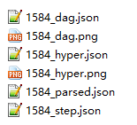

# FormalGeo-SAT

[](https://github.com/BitSecret/FormalGeo-SAT)
[](https://opensource.org/licenses/MIT)
[](https://github.com/BitSecret/FormalGeo-SAT)  
Formal representation and solving for SAT-level Euclidean plane geometry problems.  
**FormalGeo-SAT** is an extended version of **[FormalGeo](https://github.com/BitSecret/FormalGeo)**. It supports solving
more types of plane geometric problems.

## Co-work

#### Week 7 (230417): form 2023-04-17 to 2023-04-23.

**Attention:** Annotate problems in directory **Geometry3K-Other** and **GeoQA**.

| Id  | Worker | WorkLoad |                      PID                       | Skip | Submitted |
|:---:|:------:|:--------:|:----------------------------------------------:|:----:|:---------:|
|  1  |  贺艺铭   |    60    |      4826-4885 (data/raw-problems/GeoQA)       |  /   |     ×     |
|  2  |   邹佳   |    60    |      4886-4945 (data/raw-problems/GeoQA)       |  /   |     ×     |
|  3  |   朱娜   |    60    |      4946-5005 (data/raw-problems/GeoQA)       |  /   |     ×     |
|  4  |  张效凯   |    60    |      5006-5065 (data/raw-problems/GeoQA)       |  /   |     ×     |
|  5  |  郭彦钧   |    60    | 3486-3583 (data/raw-problems/Geometry3K-Other) |  /   |     ×     |
|  6  |  黄琦珂   |    60    | 3684-3792 (data/raw-problems/Geometry3K-Other) |  /   |     ×     |
|  7  |  黄一雯   |    50    |                 same as week 6                 |  /   |     ×     |
|  8  |  金啸笑   |    60    | 3793-3900 (data/raw-problems/Geometry3K-Other) |  /   |     ×     |
|  9  |   李阳   |    60    | 4109-4195 (data/raw-problems/Geometry3K-Other) |  /   |     ×     |
| 10  |  毛晨扬   |    60    | 4196-4289 (data/raw-problems/Geometry3K-Other) |  /   |     ×     |
| 11  |  王茹楠   |    50    |                 same as week 6                 |  /   |     ×     |
| 12  |  王一凡   |    50    |                 same as week 6                 |  /   |     ×     |
| 13  |  岳登峰   |    60    | 4290-4380(data/raw-problems/Geometry3K-Other)  |  /   |     ×     |
| 14  |  朱方震   |    60    |                 same as week 6                 |  /   |     ×     |
| 15  |   朱哲   |    60    | 4382-4471 (data/raw-problems/Geometry3K-Other) |  /   |     ×     |

#### Week 6 (230410): form 2023-04-10 to 2023-04-16.

**Attention:** Annotate problems in directory **Geometry3K-Other** and **GeoQA**.

| Id  | Worker | WorkLoad |                                                                           PID                                                                            | Skip | Submitted |
|:---:|:------:|:--------:|:--------------------------------------------------------------------------------------------------------------------------------------------------------:|:----:|:---------:|
|  1  |  贺艺铭   |    60    |                                                           4586-4645 (data/raw-problems/GeoQA)                                                            |  /   |     √     |
|  2  |   邹佳   |    60    |                                                           4646-4705 (data/raw-problems/GeoQA)                                                            |  /   |     √     |
|  3  |   朱娜   |    60    |                                                           4706-4765 (data/raw-problems/GeoQA)                                                            |  /   |     √     |
|  4  |  张效凯   |    60    |                                                           4766-4825 (data/raw-problems/GeoQA)                                                            |  /   |     √     |
|  5  |  郭彦钧   |    60    |                                                      3008-3097 (data/raw-problems/Geometry3K-Other)                                                      |  /   |     ×     |
|  6  |  黄琦珂   |    60    |                                                      3100-3193 (data/raw-problems/Geometry3K-Other)                                                      |  /   |     √     |
|  7  |  黄一雯   |    50    | 3254-3270 (data/raw-problems/Geometry3K-Triangle)<br>3795-3855 (data/raw-problems/Geometry3K-Triangle)<br>2682-2711 (data/raw-problems/Geometry3K-Other) |  /   |     /     |
|  8  |  金啸笑   |    60    |                                                      3196-3290 (data/raw-problems/Geometry3K-Other)                                                      |  /   |     √     |
|  9  |   李阳   |    60    |                                                      3293-3396 (data/raw-problems/Geometry3K-Other)                                                      |  /   |     √     |
| 10  |  毛晨扬   |    60    |                                                      3398-3485 (data/raw-problems/Geometry3K-Other)                                                      |  /   |     √     |
| 11  |  王茹楠   |    50    |                           4079-4169 (data/raw-problems/Geometry3K-Triangle)<br>2810-2844 (data/raw-problems/Geometry3K-Other)                            |  /   |     /     |
| 12  |  王一凡   |    50    |                           4170-4244 (data/raw-problems/Geometry3K-Triangle)<br>2849-2890 (data/raw-problems/Geometry3K-Other)                            |  /   |     /     |
| 13  |  岳登峰   |    60    |                                                      3901-3997(data/raw-problems/Geometry3K-Other)                                                       |  /   |     √     |
| 14  |  朱方震   |    60    |                                                      3999-4108(data/raw-problems/Geometry3K-Other)                                                       |  /   |     /     |
| 15  |   朱哲   |    60    |                                                      3584-3681 (data/raw-problems/Geometry3K-Other)                                                      |  /   |     √     |

#### Week 5 (230403): form 2023-04-03 to 2023-04-09.

**Attention:** Annotate problems in directory **Geometry3K-Triangle** and **Geometry3K-Other**.

| Id  | Worker | WorkLoad |                   PID                   | Skip | Submitted |
|:---:|:------:|:--------:|:---------------------------------------:|:----:|:---------:|
|  1  |  贺艺铭   |    70    |            2155-2261 (Other)            |  /   |     √     |
|  2  |   邹佳   |   140    |  1926-2046 (other), 2265-2386 (Other)   |  /   |     √     |
|  3  |   朱娜   |    70    |            2387-2502 (Other)            |  /   |     √     |
|  4  |  张效凯   |    70    |            2503-2625 (Other)            |  /   |     √     |
|  5  |  郭彦钧   |    50    | 3089-3165 (Triangle), 2626-2652 (Other) |  /   |     √     |
|  6  |  黄琦珂   |    50    | 3171-3253 (Triangle), 2653-2680 (Other) |  /   |     √     |
|  7  |  金啸笑   |    50    | 3857-3919 (Triangle), 2712-2747 (Other) |  /   |     √     |
|  8  |   李阳   |    50    | 3920-4007 (Triangle), 2748-2780 (Other) |  /   |     √     |
|  9  |  毛晨扬   |    50    | 4009-4075 (Triangle), 2781-2809 (Other) |  /   |     √     |
| 10  |  岳登峰   |    50    | 4335-4430 (Triangle), 2923-2956 (Other) |  /   |     √     |
| 11  |  朱方震   |    50    | 4435-4501 (Triangle), 2957-2984 (Other) |  /   |     √     |
| 12  |   朱哲   |    50    | 4502-4582 (Triangle), 2986-3007 (Other) |  /   |     √     |

#### Week 4 (230327): form 2023-03-27 to 2023-04-02.

**Attention:** Annotate problems in directory **Geometry3K-Other**.

| Id  | Worker | WorkLoad |        PID        | Skip |     Submitted      |
|:---:|:------:|:--------:|:-----------------:|:----:|:------------------:|
|  1  |  张效凯   |   140    | 1585-1803 (other) |  /   |         √          |
|  2  |   朱娜   |    70    | 1804-1924 (other) |  /   |         √          |
|  3  |   邹佳   |    70    | 1926-2046 (other) |  /   | (add to next week) |
|  4  |  贺艺铭   |    70    | 2048-2154 (other) |  /   |         √          |

#### Week 3 (230320): form 2023-03-20 to 2023-03-26.

**Attention:** Annotate problems in directory **Geometry3k-Triangle**.

| Id  | Worker | WorkLoad |    PID    | Skip |     Submitted      |
|:---:|:------:|:--------:|:---------:|:----:|:------------------:|
|  1  |  张效凯   |    70    | 3089-3270 |  /   | (add to next week) |
|  2  |   朱娜   |    70    | 3273-3448 |  /   |         √          |
|  3  |   邹佳   |    70    | 3451-3624 |  /   |         √          |
|  4  |  贺艺铭   |    70    | 3625-3791 |  /   |         √          |

#### Week 2 (230313): form 2023-03-13 to 2023-03-19.

**Attention:** Annotate problems in directory **Geometry3k-Triangle**.

| Id  | Worker | WorkLoad |    PID    | Skip | Submitted |
|:---:|:------:|:--------:|:---------:|:----:|:---------:|
|  1  |  张效凯   |    70    | 2397-2570 |  /   |     √     |
|  2  |   朱娜   |    70    | 2572-2742 |  /   |     √     |
|  3  |   邹佳   |    70    | 2744-2885 |  /   |     √     |
|  4  |  贺艺铭   |    70    | 2887-3083 |  /   |     √     |

#### Week 1 (230306): form 2023-03-06 to 2023-03-12.

**Attention:** Annotate problems in directory **Geometry3k-Triangle**.

| Id  | Worker | WorkLoad |    PID    | Skip | Submitted |
|:---:|:------:|:--------:|:---------:|:----:|:---------:|
|  1  |  张效凯   |   107    | 1584-1864 |  /   |     √     |
|  2  |   朱娜   |    70    | 1865-2026 |  /   |     √     |
|  3  |   邹佳   |    70    | 2028-2233 |  /   |     √     |
|  4  |  贺艺铭   |    70    | 2236-2396 |  /   |     √     |

## Introduction

Formal mathematics plays an important role in mathematical research, especially with the deepening of mathematical
research, the theory becomes obscure and difficult to understand, and computer aided verification is more needed.
Geometry involves the literal description and image representation of knowledge, the unity of algebraic calculation and
symbolic reasoning, so it is difficult to formalize.  
In addition, with the development of artificial intelligence, AI-assisted mathematics research has become a promising
research direction. For the answers to the mathematical problems generated by AI, it is also necessary to design a
reasoning machine for automatic verification.  
So we designed a plane geometry formalization system and provided a python implementation of this system, which we call
FormalGeo. It can accept formalized problem description, infer the goal and output the problem-solving process.

## Function

1.Use formal language - geometric definition language (GDL) to configure the reasoner. Therefore, compared with the
original version, the scalability and sharing are greatly improved.  
2.Use formal language - conditional declaration language (CDL) to input formalized geometric problems into the
reasoner.  
3.Get a visible, traceable, and interpretable problem-solving process. We can easily check every step of geometric
reasoning.  
4.Generate information about problem-solving process, such as solution hypertree, CDL of every step, Directed acyclic
graph of applied theorem, etc. These interfaces provide verification information for correctness of problem-solving and
facilitate AI-assisted reasoning.

## Version

#### FormalGeo-SAT 1.4 (Apr 1, 2023)

**predicates/theorems**: 71/164  
**problems**: 1166  
**new functions**:  
1.Defining geometric knowledge graph to guide the design of predicate and theorem.  
2.New Construction method that unifies all shapes in plane geometry.  
4.Added problems about circle and polygon.  
3.More readable documents.

#### FormalGeo-SAT 1.3 (Mar 12, 2023)

**predicates/theorems**: 50/77  
**problems**: 319  
**new functions**:  
1.A new theorem GDL format and corresponding problem-solving theorem sequence annotating method. (theorem seqs with
para)  
2.Better error handling mechanism. It makes data set annotation more convenient.  
3.Prepare for greedy search (forward and backward) and AI-assisted search. (rough definition of program interface and
framework)   
4.merge problem annotated in this week.

#### FormalGeo-SAT 1.2 (Mar 10, 2023)

**predicates/theorems**: 50/75  
**problems**: 249  
**new functions**:  
1.A new equations-solving method has been released, which can save 65% solving-time but only lose a little success rate.

#### FormalGeo-SAT 1.1 (Feb 28, 2023)

**predicates/theorems**: 49/83  
**problems**: 119  
**new functions**:  
1.Hierarchical structure and automatic expansion for problem conditions.  
2.New format of GDL. Simpler but more expressive.  
3.Two types of validity checks are defined: EE check and FV check.

#### FormalGeo-SAT 1.0 (Feb 21, 2023)

A simple copy of the original version "FormalGeo".  
**predicates/theorems**: 35/82  
**problems**: 116  
**functions**:  
1.Accept extensible GDL/CDL input and parse it.  
2.Forward solving.  
3.Backward solving.  
4.Interactive theorem proving.  
5.Visible, traceable, and interpretable problem-solving process.  
6.Problem-solving information output: solution hypertree (generated according to the problem-solving process), parsed
GDL/CDL, CDL in every step, theorem DAG (generated according to the problem-solving process), etc.

## Project structure

The code structure is shown below:

	./core
	    aux_tools/
	        parse.py
	        utils.py
	    problem/
	        object.py
	        problem.py
	    solver/
	        solver.py
	
	./data
	    formalized-problems/
	        0.json
	        1.json
	        ...
	    preset/
	        predicate_GDL.json
	        theorem_GDL.json
	    raw-problems/
	        Geometry3K/
	        GeometryQA/
	        GeoQA/
	        GeoQAPlus/
	        GeoS/
	        UniGeo/
	        template.json
	    solved/
	        ...
	
	./doc
	    cowork.md
	
	./main.py
	
	./README.md

`core` is the implementation code of the FormalGeo. The architecture of each module and the relationship between modules
are shown in figure.  
`cowork` displays collaboration information.  
`data` contains un-formalized but unified geometry problem datasets, such as Geometry3K, GeoQA, UniGeo, etc. It also
contains formalized problems, which stores in *data/formalized-problems*.  
`doc` is the introduction of formal system and project-related documentation.
<div align=center>
	
</div>

## Setup

	# Create python environment
	conda create -n FormalGeo python=3.10
	conda activate FormalGeo
	
	# Install python dependencies
	pip install -v sympy==1.10.1
	pip install -v graphviz==0.20.1
	
	# Execute
	python main.py

## Example

**logic inputs and reasoning process:**

	pid:1584
	problem_index: 1584
	construction_cdl:
	Polygon(RST)
	Polygon(XYZ)
	text_cdl:
	Congruent(RST,XYZ)
	image_cdl:
	Equal(LengthOfLine(TR),x+21)
	Equal(MeasureOfAngle(TRS),4*y-10)
	Equal(MeasureOfAngle(ZXY),3*y+5)
	Equal(LengthOfLine(ZX),2*x-14)
	goal_cdl:
	Value(y)
	
	theorem_applied:
	 0 init_problem        
	 1 congruent_property_angle_equal(TRS,ZXY)
	reasoning_cdl:
	 0 Polygon(RST)        
	 0 Polygon(XYZ)        
	 0 Point(R)            
	 0 Point(S)            
	 0 Point(T)            
	 0 Point(X)            
	 0 Point(Y)            
	 0 Point(Z)            
	 0 Line(RS)            
	 0 Line(ST)            
	 0 Line(TR)            
	 0 Line(XY)            
	 0 Line(YZ)            
	 0 Line(ZX)            
	 0 Angle(RST)          
	 0 Angle(STR)          
	 0 Angle(TRS)          
	 0 Angle(XYZ)          
	 0 Angle(YZX)          
	 0 Angle(ZXY)          
	 0 Triangle(RST)       
	 0 Triangle(XYZ)       
	 0 Congruent(RST,XYZ)  
	 0 Equation(-f_x+ll_tr-21)
	 0 Equation(-4*f_y+ma_trs+10)
	 0 Equation(-3*f_y+ma_zxy-5)
	 0 Equation(-2*f_x+ll_zx+14)
	 1 Equation(ma_trs-ma_zxy)
	 1 Free(y)             
	 1 MeasureOfAngle(TRS) 
	 1 MeasureOfAngle(ZXY) 
	
	Relations:
	Polygon:
	  0             R,S,T                    (-1,)          prerequisite
	  9             S,T,R                    (0,)           extended
	  13            T,R,S                    (0,)           extended
	  18            X,Y,Z                    (-1,)          prerequisite
	  27            Y,Z,X                    (18,)          extended
	  31            Z,X,Y                    (18,)          extended
	Point:
	  4               R                      (2,)           extended
	  5               S                      (2,)           extended
	  8               T                      (6,)           extended
	  22              X                      (20,)          extended
	  23              Y                      (20,)          extended
	  26              Z                      (24,)          extended
	Line:
	  2              R,S                     (1,)           extended
	  3              S,R                     (2,)           extended
	  6              S,T                     (1,)           extended
	  7              T,S                     (6,)           extended
	  11             T,R                     (10,)          extended
	  12             R,T                     (11,)          extended
	  20             X,Y                     (19,)          extended
	  21             Y,X                     (20,)          extended
	  24             Y,Z                     (19,)          extended
	  25             Z,Y                     (24,)          extended
	  29             Z,X                     (28,)          extended
	  30             X,Z                     (29,)          extended
	Angle:
	  1             R,S,T                    (0,)           extended
	  10            S,T,R                    (0,)           extended
	  14            T,R,S                    (0,)           extended
	  19            X,Y,Z                    (18,)          extended
	  28            Y,Z,X                    (18,)          extended
	  32            Z,X,Y                    (18,)          extended
	Triangle:
	  15            R,S,T                    (0,)           extended
	  16            S,T,R                    (15,)          extended
	  17            T,R,S                    (15,)          extended
	  33            X,Y,Z                    (18,)          extended
	  34            Y,Z,X                    (33,)          extended
	  35            Z,X,Y                    (33,)          extended
	Congruent:
	  36    R,S,T,X,Y,Z            (-1,)          prerequisite
	  37         X,Y,Z,R,S,T                 (36,)          extended
	  38         S,T,R,Y,Z,X                 (36,)          extended
	  39         Y,Z,X,S,T,R                 (36,)          extended
	  40    T,R,S,Z,X,Y            (36,)          extended
	  41         Z,X,Y,T,R,S                 (36,)          extended
	
	Symbols and Value:
	       ('MeasureOfAngle', ('R', 'S', 'T'))            ma_rst             None        
	       ('MeasureOfAngle', ('S', 'T', 'R'))            ma_str             None        
	       ('MeasureOfAngle', ('T', 'R', 'S'))            ma_trs              50         
	       ('MeasureOfAngle', ('X', 'Y', 'Z'))            ma_xyz             None        
	       ('MeasureOfAngle', ('Y', 'Z', 'X'))            ma_yzx             None        
	       ('MeasureOfAngle', ('Z', 'X', 'Y'))            ma_zxy              50         
	           ('LengthOfLine', ('T', 'R'))                ll_tr             None        
	           ('LengthOfLine', ('R', 'T'))                ll_tr             None        
	                 ('Free', ('x',))                       f_x              None        
	                 ('Free', ('y',))                       f_y               15         
	           ('LengthOfLine', ('Z', 'X'))                ll_zx             None        
	           ('LengthOfLine', ('X', 'Z'))                ll_zx             None        
	Equations:
	  42         -f_x + ll_tr - 21               (-1,)          prerequisite
	  43        -4*f_y + ma_trs + 10             (-1,)          prerequisite
	  44        -3*f_y + ma_zxy - 5              (-1,)          prerequisite
	  45        -2*f_x + ll_zx + 14              (-1,)          prerequisite
	  46          ma_trs - ma_zxy                (40,)          congruent_property_angle_equal(TRS,ZXY)
	  47              f_y - 15               (43, 44, 46)       solve_eq
	  48            ma_trs - 50              (43, 44, 46)       solve_eq
	  49            ma_zxy - 50              (43, 44, 46)       solve_eq
	
	Solving Goal:
	type: value
	goal: f_y
	answer: 15
	solved: True
	solved_answer: 15
	premise: (43, 44, 46)
	theorem: solve_eq
	
	Time consumption:
	init_problem:0.181281s
	congruent_property_angle_equal(TRS,ZXY):0.014099s

**Outputs files**
<div align=center>
	
</div>


**Solution hypertree**
<div align=center>
	
</div>

```json
{
  "0": {
    "conditions": [
      "Polygon(RST)"
    ],
    "theorem": "extended",
    "conclusion": [
      "Polygon(STR)",
      "Polygon(TRS)",
      "Angle(RST)",
      "Angle(STR)",
      "Angle(TRS)",
      "Triangle(RST)"
    ]
  },
  "1": {
    "conditions": [
      "Polygon(XYZ)"
    ],
    "theorem": "extended",
    "conclusion": [
      "Polygon(YZX)",
      "Polygon(ZXY)",
      "Angle(XYZ)",
      "Angle(YZX)",
      "Angle(ZXY)",
      "Triangle(XYZ)"
    ]
  },
  "2": {
    "conditions": [
      "Line(RS)"
    ],
    "theorem": "extended",
    "conclusion": [
      "Point(R)",
      "Point(S)",
      "Line(SR)"
    ]
  },
  "3": {
    "conditions": [
      "Line(ST)"
    ],
    "theorem": "extended",
    "conclusion": [
      "Point(T)",
      "Line(TS)"
    ]
  },
  "4": {
    "conditions": [
      "Line(XY)"
    ],
    "theorem": "extended",
    "conclusion": [
      "Point(X)",
      "Point(Y)",
      "Line(YX)"
    ]
  },
  "5": {
    "conditions": [
      "Line(YZ)"
    ],
    "theorem": "extended",
    "conclusion": [
      "Point(Z)",
      "Line(ZY)"
    ]
  },
  "6": {
    "conditions": [
      "Angle(RST)"
    ],
    "theorem": "extended",
    "conclusion": [
      "Line(RS)",
      "Line(ST)"
    ]
  },
  "7": {
    "conditions": [
      "Angle(STR)"
    ],
    "theorem": "extended",
    "conclusion": [
      "Line(TR)"
    ]
  },
  "8": {
    "conditions": [
      "Line(TR)"
    ],
    "theorem": "extended",
    "conclusion": [
      "Line(RT)"
    ]
  },
  "9": {
    "conditions": [
      "Angle(XYZ)"
    ],
    "theorem": "extended",
    "conclusion": [
      "Line(XY)",
      "Line(YZ)"
    ]
  },
  "10": {
    "conditions": [
      "Angle(YZX)"
    ],
    "theorem": "extended",
    "conclusion": [
      "Line(ZX)"
    ]
  },
  "11": {
    "conditions": [
      "Line(ZX)"
    ],
    "theorem": "extended",
    "conclusion": [
      "Line(XZ)"
    ]
  },
  "12": {
    "conditions": [
      "Triangle(RST)"
    ],
    "theorem": "extended",
    "conclusion": [
      "Triangle(STR)",
      "Triangle(TRS)"
    ]
  },
  "13": {
    "conditions": [
      "Triangle(XYZ)"
    ],
    "theorem": "extended",
    "conclusion": [
      "Triangle(YZX)",
      "Triangle(ZXY)"
    ]
  },
  "14": {
    "conditions": [
      "Congruent(RST,XYZ)"
    ],
    "theorem": "extended",
    "conclusion": [
      "Congruent(XYZ,RST)",
      "Congruent(STR,YZX)",
      "Congruent(YZX,STR)",
      "Congruent(TRS,ZXY)",
      "Congruent(ZXY,TRS)"
    ]
  },
  "15": {
    "conditions": [
      "Congruent(TRS,ZXY)"
    ],
    "theorem": "congruent_property_angle_equal(TRS,ZXY)",
    "conclusion": [
      "Equation(ma_trs-ma_zxy)"
    ]
  },
  "16": {
    "conditions": [
      "Equation(-4*f_y+ma_trs+10)",
      "Equation(-3*f_y+ma_zxy-5)",
      "Equation(ma_trs-ma_zxy)"
    ],
    "theorem": "solve_eq",
    "conclusion": [
      "Free(y)",
      "MeasureOfAngle(TRS)",
      "MeasureOfAngle(ZXY)"
    ]
  }
}
```

**Theorem DAG**
<div align=center>
	
</div>

```json
{
  "extended_0": [
    "extended_6",
    "extended_7",
    "extended_12"
  ],
  "extended_1": [
    "extended_9",
    "extended_10",
    "extended_13"
  ],
  "extended_2": [],
  "extended_3": [],
  "extended_4": [],
  "extended_5": [],
  "extended_6": [
    "extended_2",
    "extended_3"
  ],
  "extended_7": [
    "extended_8"
  ],
  "extended_8": [],
  "extended_9": [
    "extended_4",
    "extended_5"
  ],
  "extended_10": [
    "extended_11"
  ],
  "extended_11": [],
  "extended_12": [],
  "extended_13": [],
  "extended_14": [
    "congruent_property_angle_equal(TRS,ZXY)_15"
  ],
  "congruent_property_angle_equal(TRS,ZXY)_15": [
    "solve_eq_16"
  ],
  "solve_eq_16": []
}
```

**Parsed problem**

```json
{
  "id": 1584,
  "cdl": {
    "construction_cdl": [
      "Polygon(RST)",
      "Polygon(XYZ)"
    ],
    "text_cdl": [
      "Congruent(RST,XYZ)"
    ],
    "image_cdl": [
      "Equal(LengthOfLine(TR),x+21)",
      "Equal(MeasureOfAngle(TRS),4*y-10)",
      "Equal(MeasureOfAngle(ZXY),3*y+5)",
      "Equal(LengthOfLine(ZX),2*x-14)"
    ],
    "goal_cdl": "Value(y)"
  },
  "parsed_cdl": {
    "construction_cdl": [
      [
        "Polygon",
        [
          "R",
          "S",
          "T"
        ]
      ],
      [
        "Polygon",
        [
          "X",
          "Y",
          "Z"
        ]
      ]
    ],
    "text_and_image_cdl": [
      [
        "Congruent",
        [
          "R",
          "S",
          "T",
          "X",
          "Y",
          "Z"
        ]
      ],
      [
        "Equal",
        [
          [
            "LengthOfLine",
            [
              "T",
              "R"
            ]
          ],
          "x+21"
        ]
      ],
      [
        "Equal",
        [
          [
            "MeasureOfAngle",
            [
              "T",
              "R",
              "S"
            ]
          ],
          "4*y-10"
        ]
      ],
      [
        "Equal",
        [
          [
            "MeasureOfAngle",
            [
              "Z",
              "X",
              "Y"
            ]
          ],
          "3*y+5"
        ]
      ],
      [
        "Equal",
        [
          [
            "LengthOfLine",
            [
              "Z",
              "X"
            ]
          ],
          "2*x-14"
        ]
      ]
    ],
    "goal": {
      "type": "value",
      "item": [
        "Value",
        [
          "y"
        ]
      ],
      "answer": "15"
    }
  }
}
```

**Step msg**

```json
{
  "0": [
    "Polygon(RST)",
    "Polygon(XYZ)",
    "Point(R)",
    "Point(S)",
    "Point(T)",
    "Point(X)",
    "Point(Y)",
    "Point(Z)",
    "Line(RS)",
    "Line(ST)",
    "Line(TR)",
    "Line(XY)",
    "Line(YZ)",
    "Line(ZX)",
    "Angle(RST)",
    "Angle(STR)",
    "Angle(TRS)",
    "Angle(XYZ)",
    "Angle(YZX)",
    "Angle(ZXY)",
    "Triangle(RST)",
    "Triangle(XYZ)",
    "Congruent(RST,XYZ)",
    "Equation(-f_x+ll_tr-21)",
    "Equation(-4*f_y+ma_trs+10)",
    "Equation(-3*f_y+ma_zxy-5)",
    "Equation(-2*f_x+ll_zx+14)"
  ],
  "1": [
    "Equation(ma_trs-ma_zxy)",
    "Free(y)",
    "MeasureOfAngle(TRS)",
    "MeasureOfAngle(ZXY)"
  ]
}
```

## Acknowledge

This project is developed and maintained by *
*[Geometric Cognitive Reasoning Group of Shanghai University (GCRG, SHU)](https://euclidesprobationem.github.io/)**.   
Thank you for participating in the dataset annotation. They
are: [XiaokaiZhang](https://github.com/BitSecret), [YimingHe](https://github.com/748978460), [JiaZou](https://github.com/PersonNoName), [NaZhu](https://github.com/RuRuo0), [YanjunGuo](https://github.com/g826796047), [QikeHuang](https://github.com/huangqaqqk), [XiaoxiaoJin](https://github.com/J1372628520), [YangLi](https://github.com/leeyoung628), [ChenyangMao](https://github.com/shadymcy), [DengfengYue](https://github.com/331368068), [FangzhenZhu](https://github.com/pigsquare), [ZheZhu](https://github.com/zz863474396), [YiwenHuang](https://github.com/Eaven21), [RunanWang](https://github.com/RunanW), [YifanWang](https://github.com/yf0216).   
Some original problems come from the following dataset, which
are: [GeoS](https://geometry.allenai.org/), [Geometry3K](https://github.com/lupantech/InterGPS), [GeoQA](https://github.com/chen-judge/GeoQA), [GeometryQA](https://github.com/doublebite/Sequence-to-General-tree/), [GeoQA+](https://github.com/SCNU203/GeoQA-Plus), [UniGeo](https://github.com/chen-judge/UniGeo).  
Please contact with the author (xiaokaizhang1999@163.com) if you encounter any issues.  