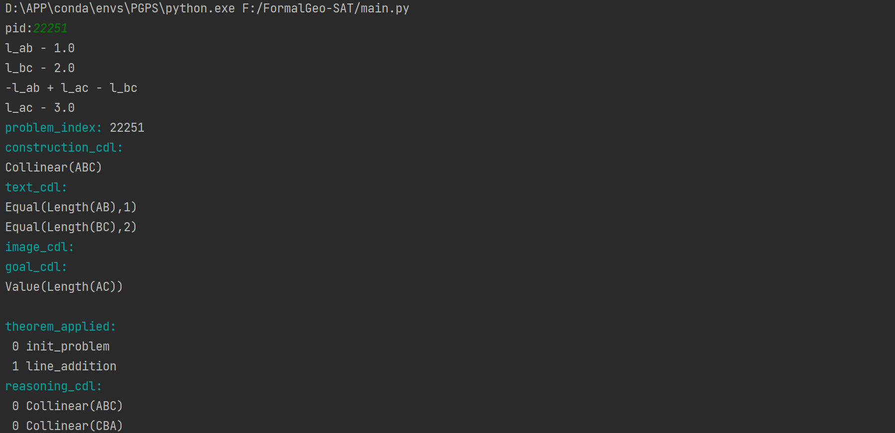
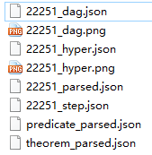

# FormalGeo-SAT
Formal representation and solving for SAT-level Euclidean plane geometry problems.  
**FormalGeo-SAT** is an extended version of **[FormalGeo](https://github.com/BitSecret/FormalGeo)**. It supports solving more types of plane geometric problems.

## Cowork
#### Week 1 (230227): form 2023-02-27 to 2023-03-05.
<table>
	<tr>
        <td align="center"><b>Worker</b></td>
	    <td align="center"><b>WorkLoad</b></td>
    <td align="center"><b>PID</b></td>
	    <td align="center"><b>Skip</b></td>
	    <td align="center"><b>Submitted</b></td>
    </tr>
    <tr>
        <td align="center">XiaokaiZhang</td>
	    <td align="center">15</td>
	    <td align="center">1584-1601</td>
	    <td align="center">[1584, 1588, 1589]</td>
	    <td align="center"><font color="green"><b>√</b></font></td>
    </tr>
    <tr>
        <td align="center">NaZhu</td>
	    <td align="center">15</td>
	    <td align="center">1602-1616</td>
	    <td align="center">[]</td>
	    <td align="center"><font color="red"><b>×</b></font></td>
    </tr>
    <tr>
        <td align="center">JiaZou</td>
	    <td align="center">15</td>
	    <td align="center">1617-1631</td>
	    <td align="center">[]</td>
	    <td align="center"><font color="red"><b>×</b></font></td>
    </tr>
    <tr>
        <td align="center">YimingHe</td>
	    <td align="center">15</td>
	    <td align="center">1632-1646</td>
	    <td align="center">[]</td>
	    <td align="center"><font color="red"><b>×</b></font></td>
    </tr>
</table>

## Introduction
Formal mathematics plays an important role in mathematical research, especially with the deepening of mathematical research, the theory becomes obscure and difficult to understand, and computer aided verification is more needed. Geometry involves the literal description and image representation of knowledge, the unity of algebraic calculation and symbolic reasoning, so it is difficult to formalize.  
In addition, with the development of artificial intelligence, AI-assisted mathematics research has become a promising research direction. For the answers to the mathematical problems generated by AI, it is also necessary to design a reasoning machine for automatic verification.  
So we designed a plane geometry formalization system and provided a python implementation of this system, which we call FormalGeo. It can accept formalized problem description, infer the goal and output the problem solving process.  

## Function
1.Use formal language - geometric definition language (GDL) to configure the reasoner. Therefore, compared with the original version, the scalability and sharing are greatly improved.  
2.Use formal language - conditional declaration language (CDL) to input formalized geometric problems into the reasoner.  
3.Get a visible, traceable, and interpretable problem-solving process. We can easily check every step of geometric reasoning.  
4.Generate information about problem-solving process, such as solution hypertree, CDL of every step, Directed acyclic graph of applied theorem, etc. These interfaces provide verification information for correctness of problem-solving and facilitate AI-assisted reasoning.

## Version
#### FormalGeo-SAT 1.0 (Feb 21, 2023)
A simple copy of the original version "FormalGeo".  
**predicates/theorems**: 35/82  
**problems**: 116  
**functions**:  
1.Accept extensible GDL/CDL input and parse it.  
2.Forward solving.  
3.Backward solving.  
4.Interactive theorem proving.  
5.Visible, traceable, and interpretable problem-solving process.  
6.Problem-solving information output: solution hypertree, parsed GDL/CDL, CDL in every step, theorem DAG...  

## Project structure
The code structure is shown below:  
```bash
./core
    aux_tools/
        parse.py
        utils.py
    problem/
        object.py
        problem.py
    solver/
        solver.py

./data
    formalized-problems/
        0.json
        1.json
        ...
    preset/
        predicate_GDL.json
        theorem_GDL.json
    raw-problems/
        Geometry3K/
        GeometryQA/
        GeoQA/
        GeoQAPlus/
        GeoS/
        UniGeo/
        template.json
    solved/
        ...

./doc
    cowork.md

./main.py

./README.md
```

`core` is the implementation code of the FormalGeo. The architecture of each module and the relationship between modules are shown in figure 1.  
`cowork` displays collaboration information.  
`data` contains unformalized but unified geometry problem datasets, such as Geometry3K, GeoQA, UniGeo, etc. It also contains formalized problems, which stores in *data/formalized-problems*.  
`doc` is the introduction of formal system and project-related documentation.  
<div align=center>
	
</div>
<div align=center>
	Figure 1. Architecture
</div>

## Setup
```bash
# Create python environment
conda create -n FormalGeo python=3.10
conda activate FormalGeo

# Install python dependencies
pip install -v sympy==1.10.1
pip install -v graphviz==0.20.1

# Execute
python main.py
```

## Example
**logic inputs and reasoning process:**  
<div align=center>
	
	
	
	
</div>
<div align=center>
	Figure 2. Visible, traceable, and interpretable problem-solving process
</div>

**Outputs:** 
<div align=center>
	
</div>
<div align=center>
	Figure 3. Outputs
</div>
<div align=center>
	
</div>
<div align=center>
	Figure 4. Solution hypertree
</div>
<div align=center>
	
</div>
<div align=center>
	Figure 5. Theorem DAG
</div>

## Acknowledge
Thanks for the support of the **[Geometric Cognitive Reasoning Group of Shanghai University (GCRG, SHU)](https://euclidesprobationem.github.io/)**.   
Thank you for participating in the dataset annotation. They are: [XiaokaiZhang](https://github.com/BitSecret), [YimingHe](https://github.com/748978460), [JiaZou](https://github.com/PersonNoName), [NaZhu](https://github.com/RuRuo0), [YanjunGuo](https://github.com/g826796047), [QikeHuang](https://github.com/huangqaqqk), [XiaoxiaoJin](https://github.com/J1372628520), [YangLi](https://github.com/leeyoung628), [ChenyangMao](https://github.com/shadymcy), [ChanghaoWu](https://github.com/changhaowu), [DengfengYue](https://github.com/331368068), [FangzhenZhu](https://github.com/pigsquare), [ZheZhu](https://github.com/BitSecret)   
Thank you for the work of the original datasets, which are: [GeoS](https://geometry.allenai.org/), [Geometry3K](https://github.com/lupantech/InterGPS), [GeoQA](https://github.com/chen-judge/GeoQA), [GeometryQA](https://github.com/doublebite/Sequence-to-General-tree/), [GeoQA+](https://github.com/SCNU203/GeoQA-Plus), [UniGeo](https://github.com/chen-judge/UniGeo).  
Please contact with the author (xiaokaizhang1999@163.com) if you encounter any issues.  