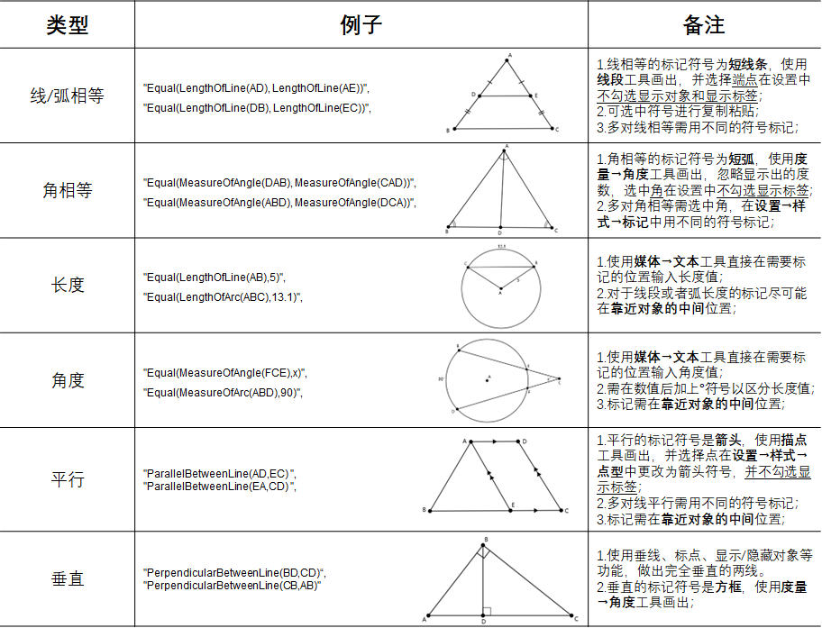
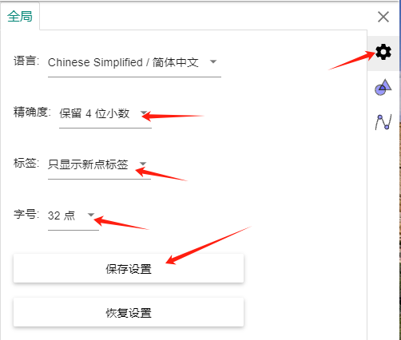
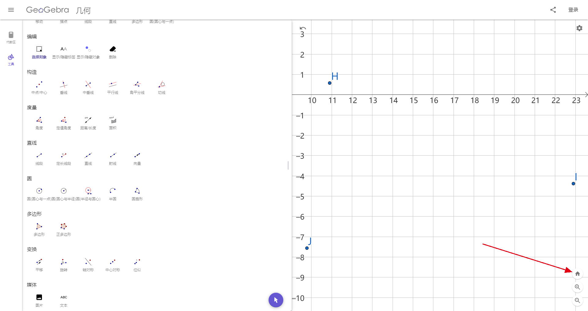

# Datasets

先前的形式化标注工作耗费了大量的人力物力，最终得到了6981道可以成功求解的题目。对于新的几何问题，仍需熟悉FormalGeo形式化系统的专家手动标注，
不能实现完全智能的几何问题自动求解，因此需要开展自动形式化的研究。然而上次标注并未一步到位，formalgeo7k数据集的原始问题来自Geometry3K、GeoQA
和GeoQA+数据集，自然语言问题描述和图像质量低、风格不统一，严重削弱了数据集的价值。关于自动形式化的研究已经在先进模型上进行了初步实验，
formalgeo7k原始文本和图像质量较低，严重限制了模型的学习效果；后续的局部关联模型方法也需要更细粒度的图像注释，故当前急切的任务是提高
formalgeo7k自然语言问题描述和图像的质量，统一表述风格。

自然语言问题描述已经使用一些正则化的方法，从形式化语言逆向生成。然而对于几何问题的图像，涉及到跨模态的问题，尚无自动化的方法可以自动生成，只能再
一次辛苦大家标注一下几何图像了。

访问[FormalGeo主页](https://formalgeo.github.io/)获取更多有关FormalGeo的信息。

## 本周任务分配

#### Week 1 (240101): form 2024-01-01 to 2024-01-07.

**注意：** 按照PID（Problem Id）标注自己分配的题目。

| Id | Annotator | WorkLoad |   PID    | Submitted |
|:--:|:---------:|:--------:|:--------:|:---------:|
| 1  |    朱娜     |   100    |  1-100   |     ×     |
| 2  |    郭彦钧    |    70    | 101-170  |     ×     |
| 3  |    贺艺铭    |    70    | 171-240  |     ×     |
| 4  |    黄琦珂    |    70    | 241-310  |     ×     |
| 5  |    胡正彧    |    70    | 311-380  |     ×     |
| 6  |    金啸笑    |    70    | 381-450  |     ×     |
| 7  |    李阳     |    70    | 451-520  |     ×     |
| 8  |    毛晨扬    |    70    | 521-590  |     ×     |
| 9  |    秦城     |    70    | 591-660  |     ×     |
| 10 |    岳登峰    |    70    | 661-730  |     ×     |
| 11 |    张效凯    |    70    | 731-800  |     ×     |
| 12 |    朱方震    |    70    | 801-870  |     ×     |
| 13 |    朱哲     |    70    | 871-940  |     ×     |
| 14 |    邹佳     |    70    | 941-1010 |     ×     |

## 环境配置

### 项目和环境配置

下载项目:

    $ git clone --depth 1 https://github.com/RuRuo0/Datasets.git

新建Python环境:

    $ conda create -n formalgeo python=3.10
    $ conda activate formalgeo
    $ pip install formalgeo

新建个人分支并推送到远程仓库：

    $ git checkout -b your_name
    $ git push --set-upstream origin your_name

### 标注工具

为了实现上述目标，且尽量简化标注工作，最终考虑使用GeoGebra进行图像标注。GeoGebra是一款集数学、几何、代数和微积分于一体的动态数学软件，其中的
几何画图拥有丰富的工具来创建几何图形，并且可通过代数表达式来表示图形。我们可以获取图像 **.png** 文件和图像 **.gbb**
文件，并通过解析.gbb文件获取想要的细粒度信息(如点坐标、基元类别等)。  
可以直接使用[在线网站](https://www.geogebra.org/geometry)，也可以将软件[下载](https://www.geogebra.org/download)到本地。

### 标注协作
本次标注仍然使用Github来协作。在每次标注前，跟主分支同步：

    $ git pull origin main

完成每周的标注任务后，提交到远程仓库：

    $ git add projects/formalgeo7k/problems
    $ git add projects/formalgeo7k/diagrams
    $ git commit -m "your_name week_number"
    $ git push

注意：不要add其他文件，否则会导致分支合并冲突。

## 标注任务和流程

本次标注工作为图像标注，相较于上次形式化标注工作较为轻松，主要有两个任务。第一个任务是检查构图语句是否标注正确，第二个任务是重新画几何图形。标注
过程中主要涉及的对象有：原始几何图像、几何问题JSON文件中的construction_cdl和image_cdl、GeoGebra画图工具。  
几何图像文件位于：`projects/formalgeo7k/diagrams`  
几何问题JSON文件位于：`projects/formalgeo7k/problems`  
运行解题程序的脚本位于：`projects/formalgeo7k/files/main.py`

### Task1：构图语句检查

对照原始图像和construction_cdl，查看construction_cdl的标注是否正确，是否有漏掉的图形，是否符合构图语句的标注要求。因为所有问题都已经过
验证，可以成功求解。当construction_cdl与原始图像不一致时，以construction_cdl为准。这个任务其实是交叉检验一下上次标注的质量。  
构图语句的标注方式，具体可见章节[构图语句](#标注参考：构图语句)。

### Task2：画几何图形

根据几何问题JSON文件、参考原始几何图像、使用GeoGebra重新画几何图像。步骤为：  
1.根据JSON文件中的**construction_cdl**画出**基本图形**。可参考原始问题图像，但注意存在新增辅助线和表示点字母不一致等情况。  
2.图像中能表示的几何关系种类有限，如下图所示。在画图之前，需要检查text_cdl与image_cdl的可标注类型语句：①删去image_cdl中，不在下图可标注
类型中的语句。②若可标注类型语句在text_cdl但不在image_cdl，将其从text_cdl复制到image_cdl。  

    

3.根据JSON文件中的**image_cdl**在基本图像上标出对应**符号**和**文本**，标注方法如上图所示。  
4.画完图后，获取图像 **.png** 文件以及 **.gbb** 文件，以题号命名，一同上传至`projects/formalgeo7k/diagrams`文件夹下，并将
原始几何图像文件覆盖。  
GeoGebra的画图注意事项，具体可见章节[GeoGebra画图](#标注参考：GeoGebra画图)。

## 标注参考：GeoGebra画图

GeoGebra可供操作的工具非常丰富，但我们的标注工作需要使用的工具可以简略到只使用描点、线段、圆、角度、文本这些工具以及设置中对对象的一些编辑。
大家可以自行熟悉GeoGebra的操作，可灵活使用各种方法来画出图像。

#### 使用前设置

点击右上角设置按钮->设置，打开设置，设置字号为32，设置4位精度，并锁定XY轴。

    

    

拉动中间的线，将右侧画图区调整为正方形。可以在设置中打开坐标轴作为参考，来调整为正方形。

    

在每次画新的图形前，点击右下角的小房子，这样坐标轴原点会位于画图区中心点。这是必须的操作，不然无法解析点的坐标。

    

#### 导出

我们需要导出几何图形的 **.gbb** 文件和 **.png** 文件，需注意：  
1.请确认右侧画图区已经调整为正方形。  
2.右上角设置点击**适应窗口**，将图形充满屏幕。若图形变形或文字符号太小，请查阅上一小节[使用前设置](#使用前设置)。

    

3.不要导出网格线和坐标轴。在画图时可以点开网格线作为参考，导出png时请关闭网格线和坐标轴。  
4.框选所有图形，将所有对象颜色统一成黑色（框选所有对象，右键->设置->颜色）。  
5.右上角导出 **.png** 文件以及 **.gbb** 文件，以题号命名，一同上传至`projects/formalgeo7k/diagrams`文件夹。
（注意不要使用ctrl+s快捷键，可能会覆盖之前已经画好的图形）

#### 注意事项

1.几何图像需要跟JSON文件一一对应。图像中显示的点、线、弧对象一定是和construction_cdl一一对应的，可通过修改点的命名以及选择不显示对象或标签
来实现正确图形显示，后续需从.gbb文件中解析出这些信息。image_cdl只要能在图像上显示出来即可，不涉及.gbb文件的解析。

## 标注参考：构图语句

构图谓词一共有三个，分别是Shape、Collinear和Cocircular。

#### Shape(*)

Shape是最基本的构图谓词，它使用若干个边或弧来声明一个封闭几何图形，这个几何图形可以是一个角，也可以是边和弧围成的图形。对于封闭几何图形，按照
逆时针方向依次列出图形的边；对于不封闭的几何图形，先连接图形缺口使其转化为封闭的几何图形。

    

**1.声明一个点**  
如图1所示，P是圆O的圆心，我们可以这样声明一个点：

    Shape(P)

**2.声明一条线段**  
如图2所示，AB是线段的两点，我们可以这样声明线段：

    Shape(AB)

当使用Shape声明线段时，默认线段是无向的，所以这样声明也是合法的：

    Shape(BA)

**3.声明一个角**  
如图3所示，角B由两条线段构成。需要注意，在声明角时，线段是有向的，两条线出现的顺序按照逆时针的方向，首尾相接。因此角B可以表示为：

    Shape(AB,BC)

**4.声明一个封闭图形**  
如果一个边一个边或一个角一个角来声明图形，未免也太麻烦了。我们可以直接声明一个由若干线段和弧构成的图形，在构图阶段，推理器会自动扩展出图形中的
角、线和弧。因此我们在标注图形的构图语句时，先使用Shape声明所有的最小封闭图形，然后在把那些不封闭的最小图形如角、线段、点等声明，就可以声明整个图形。  
对于图3中的四边形，我们可以这样声明：

    Shape(AB,BC,CD,DA)
    Shape(BC,CD,DA,AB)
    Shape(CD,DA,AB,BC)
    Shape(DA,AB,BC,CD)

一个四边形有上述四种表示，我们选择一种就可以。  
更复杂的图形，如图4，可以声明为：

    Shape(OAB,BE,EA)
    Shape(OBC,CE,EB)
    Shape(EC,OCD,DP,PE)
    Shape(AE,EP,PD,ODA)

需注意，虽然EP和PD是共线的，但在声明封闭图形时，不能直接声明ED，需要把最小的边都声明出来。  
封闭图形可以由线和弧构成，线有两个方向，弧只有一个方向。在声明线时，需要按照逆时针的方向，各点首尾相接；声明弧时，需注意弧只有一种表示方法。  
当弧单独出现时，不需要使用Shape来声明，因为弧的出现必然伴随着Cocircular谓词，所有弧将会由Cocircular谓词自动扩展得到。

#### Collinear(*)

Collinear用来声明3个及3个以上的共线点，2点一定是共线的，所以不用声明2点。

    

共线声明是及其简单的，只要按顺序列出一条线上所有的点即可，如图1中的共线可声明为：

    Collinear(AMB)

共线没有方向之分，从另一个方向声明也是合法的：

    Collinear(BMA)

图2中的共线可声明为：

    Collinear(BCDEF)

图3中的共线可声明为：

    Collinear(ADB)
    Collinear(AEC)

共线会在推理器中自动扩展出所有的线和平角，如Collinear(AMB)会扩展得到Line(AM),Line(MB),Line(AM),Angle(AMB),Angle(BMA)。

#### Cocircular(O,*)

Cocircular用来声明共圆的若干个点，与Collinear相同，按照顺序列出若干点即可；但也与Collinear不同，一是即使1个点在圆上也要声明，二是共圆的
声明按照逆时针方向，且从任何点开始都可。

    

在图1中，共圆的几点可声明为：

    Cocircular(O,ABCD)
    Cocircular(O,BCDA)
    Cocircular(O,CDAB)
    Cocircular(O,DABC)

图1的共圆声明可以有上述4种形式，任选其1即可。图2到图4是几种比较特殊的共圆声明。
图2的圆上只有1个点，也要声明：

    Cocircular(O,A)

图3圆上没有点，也要声明：

    Cocircular(O)

图4两圆有公共点，要分别声明：

    Cocircular(O,AB)
    Cocircular(P,BA)

共圆声明后，会自动扩展出所有的弧和圆。

## 任务分配

#### Week 1 (240101): form 2024-01-01 to 2024-01-07.

**注意：** 按照PID（Problem Id）标注自己分配的题目。

| Id | Annotator | WorkLoad |   PID    | Submitted |
|:--:|:---------:|:--------:|:--------:|:---------:|
| 1  |    朱娜     |   100    |  1-100   |     ×     |
| 2  |    郭彦钧    |    70    | 101-170  |     ×     |
| 3  |    贺艺铭    |    70    | 171-240  |     ×     |
| 4  |    黄琦珂    |    70    | 241-310  |     ×     |
| 5  |    胡正彧    |    70    | 311-380  |     ×     |
| 6  |    金啸笑    |    70    | 381-450  |     ×     |
| 7  |    李阳     |    70    | 451-520  |     ×     |
| 8  |    毛晨扬    |    70    | 521-590  |     ×     |
| 9  |    秦城     |    70    | 591-660  |     ×     |
| 10 |    岳登峰    |    70    | 661-730  |     ×     |
| 11 |    张效凯    |    70    | 731-800  |     ×     |
| 12 |    朱方震    |    70    | 801-870  |     ×     |
| 13 |    朱哲     |    70    | 871-940  |     ×     |
| 14 |    邹佳     |    70    | 941-1010 |     ×     |

#### Week 2 (240101): form 2024-01-08 to 2024-01-14.

#### Week 3 (240101): form 2024-01-15 to 2024-01-21.

#### Week 4 (240101): form 2024-01-22 to 2024-01-28.

#### Week 5 (240101): form 2024-01-29 to 2024-02-04.
