# FormalGeo20K数据集标注指南
随着现代科学的深入发展，学科分支变得越来越多，科学理论变得艰深难懂，同行审阅周期越来越长，阻碍了科学的进一步发展。自计算机出现以来，人们就尝试利用计算机强大的运算和推理能力来辅助科学研究，但受限于计算机的特点，需要先将科学知识转化为结构化的形式。在几何形式化、几何机械化领域，长期受制于三大难题：知识形式难统一、证明过程不可读、几何证明无定法。设计一套有严密语法结构但同时符合人类阅读习惯的、统一几何问题文字描述和图像描述的、统一计算和推理过程的形式化语言，是解决上述三大难题的一条可行路径。

## 1.形式化语言简介
FormalGeo形式化语言包括两大组成部分，分别是**几何定义语言（GDL）**和**条件声明语言（CDL）**。GDL用于配置推理器，使其具有可扩展性；CDL用于几何问题的形式化输入。FormalGeo形式化语言采用类似谓词逻辑的语法结构，非常容易上手,在标注工作中，我们只需关注如何将几何问题转化为CDL即可。

### 1.1几何本体论与几何表示论
**几何本体论**研究几何学领域的根本性本体，以及本体之间的关系，是问题**我们需要形式化那些东西？**的回答，其理论成果如下图所示。

    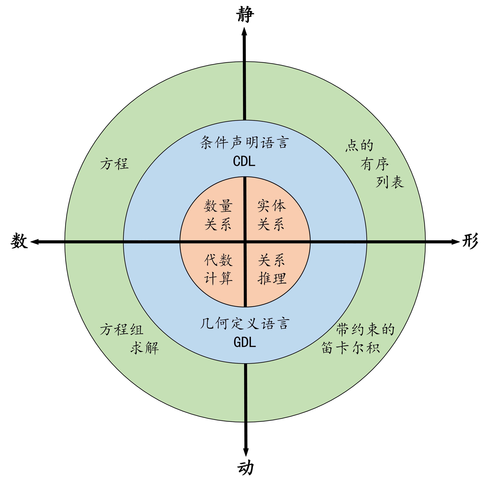
     
    Figure 1. 几何本体域-二维四象限

**几何表示论**是研究如何使用文字或符号来表示几何图形的理论，是问题**我们如何形式化？**的回答，其理论成果包括对应一致性原则和构造性作图法。对应一致性原则是指原始系统和形式化系统的静态描述和动态过程要一一对应。在几何领域，静态描述指的是几何问题的条件，动态过程是指定理。构造性作图法采用最少数量的形式化语句来描述几何图形，并按照机械化的方法自动构建出所有的几何元素。

### 1.2语法
**CDL**采用点的有序对来描述几何图形，根据其作用，可以分为三类。第一类是**构图语句**，包括基本构图语句和基本实体，推理器利用少量构图语句来构建所有的几何元素；第二类是**条件语句**，用于描述几何问题的前提条件，包括数量关系和实体关系；第三类是**目标语句**，用于声明几何问题的求解目标。  
CDL语法与谓词逻辑类似，非常简单易学，我们举几个例子：  

    Triangle(ABC)
    CongruentBetweenTriangle(ABC,DEF)
    Equal(LengthOfLine(AB),LengthOfLine(CD))

很显然，第一句话声明了一个三角形，ABC是三角形的三个顶点；第二句话声明了一个关系，即三角形ABC和三角形DEF全等；第三句话声明了一个数量关系，即直线AB的长度与直线CD的长度相等。  
现在我们介绍几个基本的概念。  
在上述两条CDL语句中，*Triangle*、*Equal*和*CongruentBetweenTriangle*称作**谓词**，用于描述一种几何元素或几何元素之间的关系；*括号中的内容*称为**个体词**，在实体关系中，个体词为点的有序对，在数量关系中，个体词为由实数、运算符和符号构成的表达式；*LengthOfLine*称为**函数**，是个体词到个体词的映射，准确来说是实体关系个体词到代数关系个体词的映射，我们通过这样的映射，就可以用点的有序对来表示数量关系，实现了实体关系和数量关系表示形式的统一。  

## 2.环境配置
我们需要配置以下环境，熟悉环境配置的朋友可以自行安装，不熟悉的可以参照本章安装教程。  

    # python版本和依赖库
    python==3.10
	sympy==1.10.1
	graphviz==0.20.1
	
    # 方便python项目开发的IDE(任何一种都可以)
    Pycharm
    
    # 多人协作
    Git

### 2.1 python环境配置
#### 2.1.1 Conda安装
Conda是一个开源包管理系统和环境管理系统，包括多种语言的包安装、运行、更新、删除，可以解决包依赖问题，分为Anaconda和Miniconda两个安装版本。Anaconda包括Conda、Python以及一大堆安装好的工具包，如numpy、pandas等；Miniconda是一个精简版本，只包括Conda、Python。我们只需安装Miniconda即可。  
1.登陆[官网](https://conda.io/en/latest/miniconda.html)下载安装包：

    

2.无脑next到这里，勾选以下内容：

    

3.继续无脑next，直到安装完成。打开命令窗口，输入命令查看安装版本，检查是否安装成功：

    # 查看安装版本
    > conda --version
	conda 23.1.0
	
	# 换国内源，为后续各种包下载做准备
	> conda config --add channels https://mirrors.tuna.tsinghua.edu.cn/anaconda/pkgs/free/
	> conda config --add channels https://mirrors.tuna.tsinghua.edu.cn/anaconda/pkgs/main/
	> conda config --set show_channel_urls yes
	> conda config --show channels
	channels:
	  - https://mirrors.tuna.tsinghua.edu.cn/anaconda/pkgs/main/
	  - https://mirrors.tuna.tsinghua.edu.cn/anaconda/pkgs/free/
	  - defaults

#### 2.1.2 利用Conda安装python

	# 创建python3.10环境并激活
    > conda create -n FormalGeo python=3.10
    > conda activate FormalGeo 
	
    # 安装python依赖库
    (FormalGeo)> pip install -v sympy==1.10.1
    (FormalGeo)> pip install -v graphviz==0.20.1
    (FormalGeo)> pip install -v func_timeout==4.3.5
    
    # 检查是否安装成功
    (FormalGeo)> pip list
    Package      Version
	------------ ---------
	certifi      2022.12.7
	graphviz     0.20.1
	mpmath       1.2.1
	pip          22.3.1
	setuptools   65.6.3
	sympy        1.10.1
	wheel        0.38.4
	wincertstore 0.2

#### 2.1.3 安装pycharm
pycharm一款用于python项目开发的IDE。安装pycharm主要是为了：①方便运行python代码和查看程序输出②查看md格式文档和阅读json格式数据。你也可以使用你自己习惯的IDE来运行python程序和查看特定格式的文件，如VS Code、Jupyter Notebook等。  
1.登陆[官网](https://www.jetbrains.com/zh-cn/pycharm/)下载安装包(社区版)：

    

2.在这一页勾选几项个性化配置，其他都无脑next：

    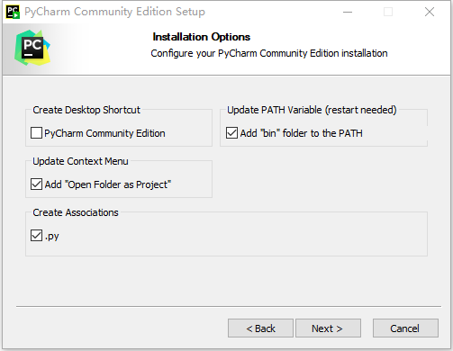

### 2.2 Graphviz安装
登陆[官网](https://graphviz.org/download/)下载安装包，一步步安装即可：  

    

将Graphviz安装路径中的bin目录添加到环境变量path中，选择 我的电脑->属性->高级系统设置->环境变量->Path->新建：  

    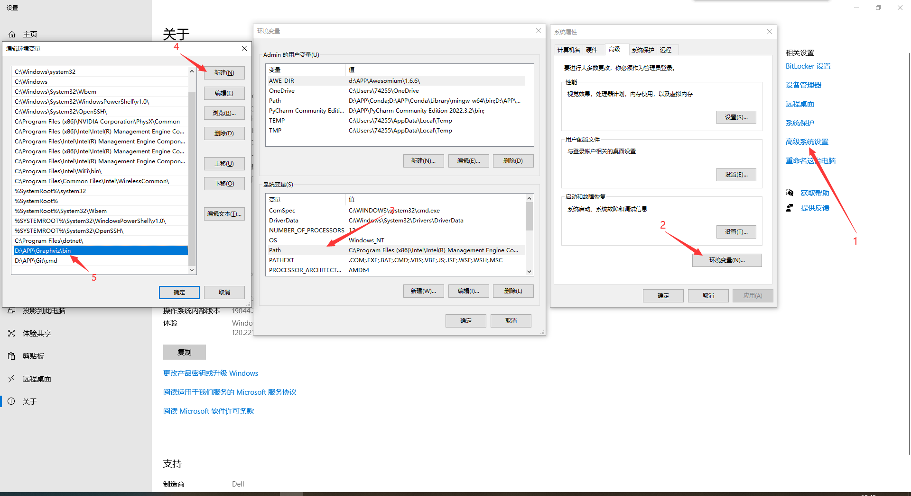

打开命令窗口，输入指令查看是否安装配置成功。  

    > dot -v
    dot - graphviz version 6.0.1 (20220911.1526)

### 2.3 Git安装
Git是一种分布式版本控制系统，用于多人协作项目开发时的版本控制，方便版本管理，非常的好用。我们的标注工作不涉及代码修改，只涉及文件的上传，只需学习几个简单的git命令就可以。  
1.登陆[官网](https://git-scm.com/)下载安装包：  

    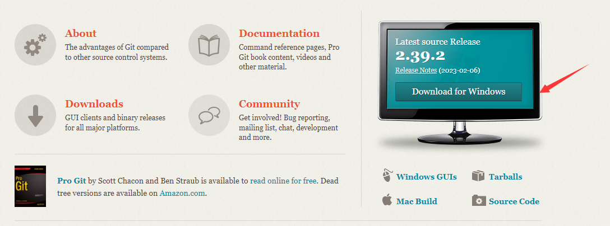
    

2.按照其默认的勾选，无脑next，直到安装完成：

    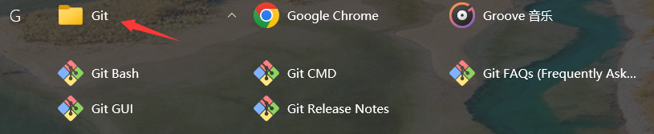

3.首次使用，配置用户名和邮箱，在任意目录下右键，选择 Git Bash Here：

    

	# 设置用户名和邮箱
	$ git config --global user.name <your_name>
	$ git config --global user.email <your_email>

	# 查看当前配置
	$ git config --global --list
	user.email=<your_email>
	user.name=<your_name>

### 2.4项目初始化配置
1.新建项目文件夹，并右键，选择 Git Bash Here：

    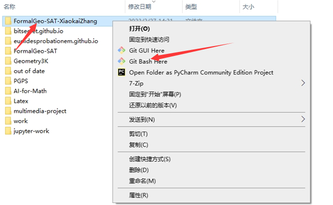

2.初始化git并从远程仓库下载项目

	# 初始化git
	$ git init

	# 添加远程协作仓库
	$ git remote add origin https://github.com/BitSecret/FormalGeo-SAT.git

	# 拉取远程主分支到本地新分支，<your_name>换成你自己的名字，如 xiaokaizhang
	$ git fetch origin main:<your_name>

	# 切换到你的本地分支
	$ git checkout <your_name>

	# 将你的本地新分支推送到远程仓库
	$ git push --set-upstream origin <your_name>

如果一切顺利，现在你的本地仓库已经有了我们的项目文件：

    

查看我们的[远程协作仓库](https://github.com/BitSecret/FormalGeo-SAT)，也有了你的远程分支：

    
    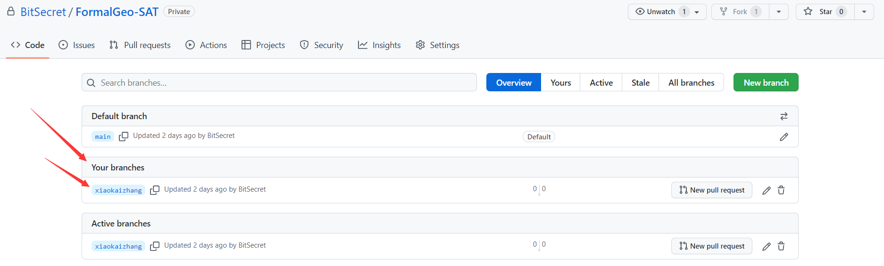

3.添加 .gitignore 文件：  
添加.gitignore文件到你的项目目录，其作用是忽略你的IDE产生的、与项目无关的缓存or配置文件，内容为：  

    .idea
	__pycache__
	.gitignore
	data/solved

    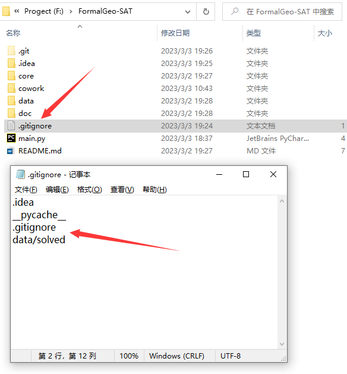

文件的内容如图所示。如果你用的是其他IDE，请将对应的缓存/配置文件或文件夹添加到.gitignore文件中。  
4.pycharm项目配置  
在你的项目文件夹右键，选择作为pycharm项目打开。  

    

将data和doc两个文件夹标记为Excluded，这样就不会为文件编制索引，加快打开速度。选择 文件->设置->项目->项目结构：  

    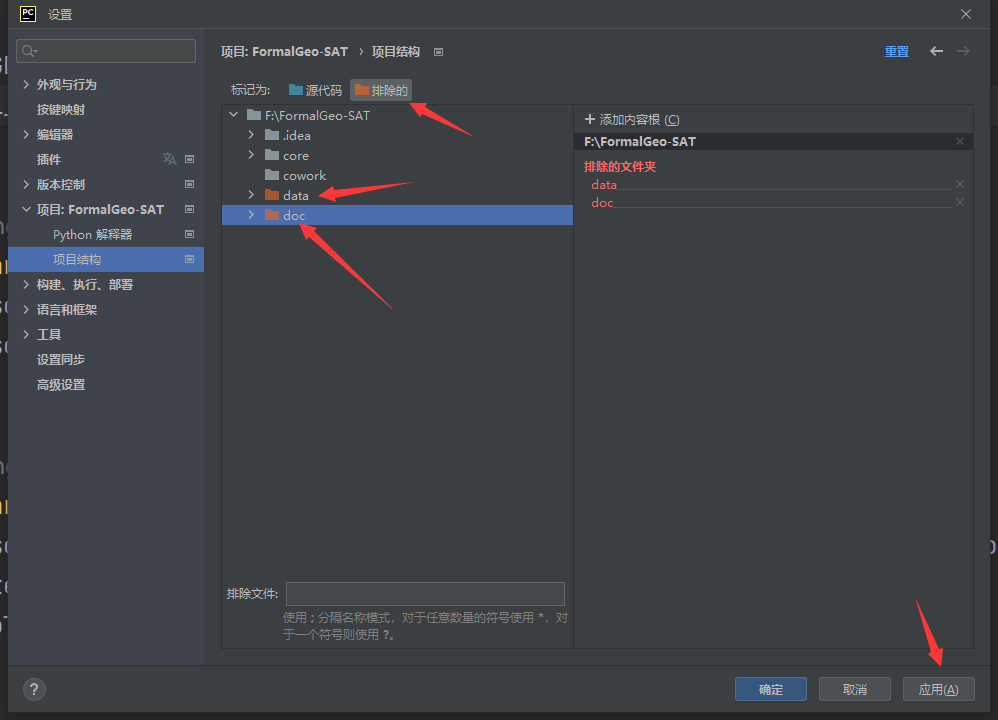

加载完成后，选择 文件->设置->项目->python解释器->全部显示：  

    

点击+号，选择Conda环境，将你的Conda安装地址配置到pycharm中，同时选择我们在2.1节新建的python3.10环境：  

    

选定我们的python环境，然后点击应用：  

    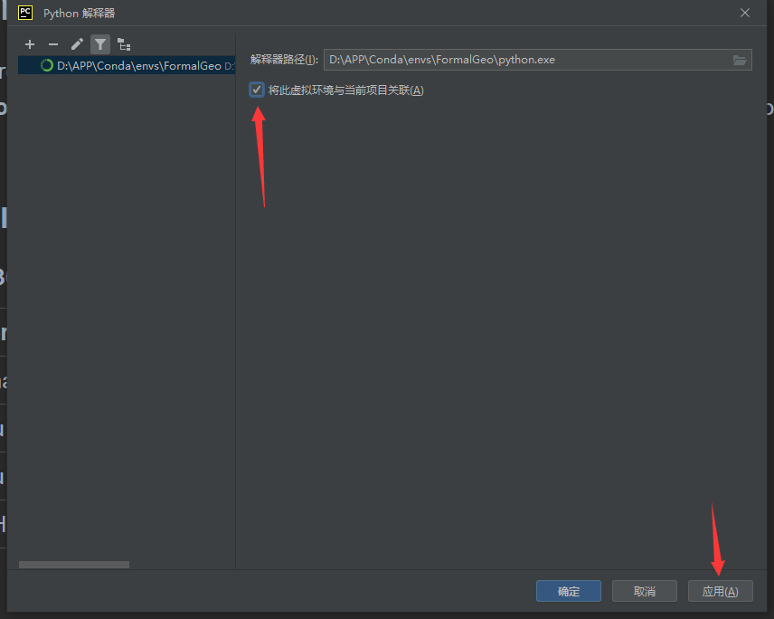

选择python解释器，点击应用：  

    

配置完成后，会载入环境，编制索引，加载较慢，耐心等待。  
5.首次运行  
右键 main.py ，选择运行。若程序成功编译并输出 pid： ，则证明环境配置成功。  

    
    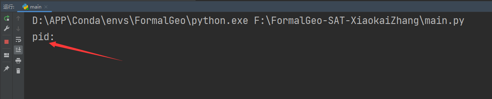

随便输入一个 data/formalized-problems 文件夹中的序号，查看推理器输出：

    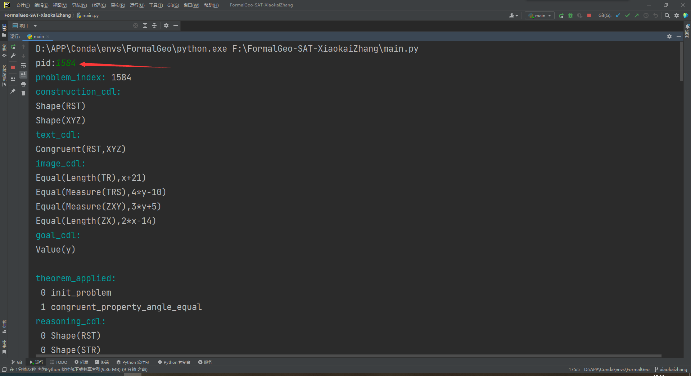

## 3.标注协作
### 3.1与主分支同步
在项目文件夹右键，选择Git Bash Here：

    

输入以下指令，将远程主分支的更新内容拉取到你的本地分支：  

	$ git pull origin main

阅读README.md，获取每周的任务分配：

    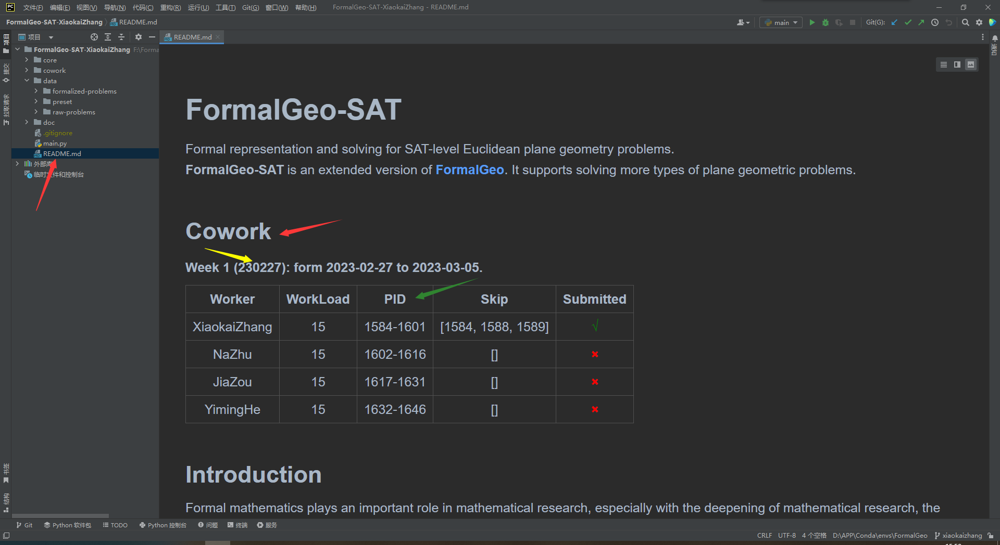

上图中黄色箭头是每周的**标注识别号**，绿色箭头是每个人分配的题号，原始题目在 data/raw-problems 文件夹，共6个数据集，已经化为了统一的格式。
### 3.2标注(1个)问题
1.从 data/raw_problems 复制题目到 data/formalized-problems  
2.标注并保存问题   

    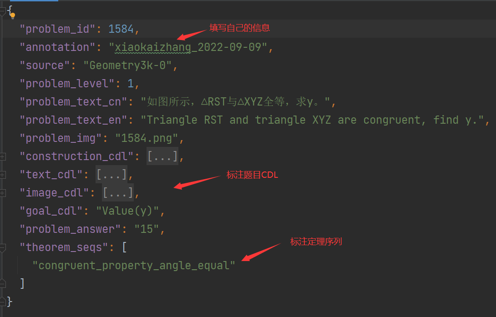

3.运行推理器，查看问题是否成功求解  

### 3.3提交已标注的问题
在每周的标注任务**全部完成后**，将所有的标注文件统一提交。  
1.在项目文件夹右键，选择Git Bash Here：

    

2.提交已标注的问题  
注意：**只提交 data/formalized-problems 文件夹**，其他地方的改动不要提交！  

	# 添加已标注的问题
	$ git add data/formalized-problems

    # 提交文件，annotation_code即标注识别号，每周一在REAMDE.md发布
	$ git commit -m "<your_name> <annotation_code>"

    # 推送到远程仓库
    $ git push

## 4.注意事项和常见报错
### 4.1时间安排
A、每周的任务需在周日晚24点之前提交。  
B、每周一上午12点之前发布任务、更新主分支内容。  
C、每个人第N周提交的内容将会在第N+1周周日24点之前合并到主分支。  
### 4.2沟通交流
标注过程遇到任何问题及时沟通，直接在群里提出或与小组长沟通。

## 附录1 标注指南
**1.先构图后标注**  
首先标注**基本构图CDL**，有3个，分别是Shape、Collinear和Cocircular。在推理器构图阶段，会根据识别到的基本构图CDL自动构建基本实体CDL，参见下图。标注完基本构图CDL后，还需要补充标注无法由基本构图CDL扩展得到的**基本实体CDL**（这就要求对于构图过程比较熟悉）。然后标注**问题文本CDL**，即问题的自然描述转化来的CDL。其次标注**问题图形CDL**，即问题的图像转化来的CDL。再次标注**解题目标CDL**，共有三类，分别是Value、Equal、Relation。最后标注**定理序列CDL**，根据推理器执行结果不断调整定理，直至解题完成。   

    

**2.有序原则**  
沿着图形的边将图形的点一一列出。    

**3.逆时针原则**  
按照逆时针的方向，将图形的点按顺序列出，如多边形、角、三角形等。逆时针原则主要是为了区分镜像图形。  

    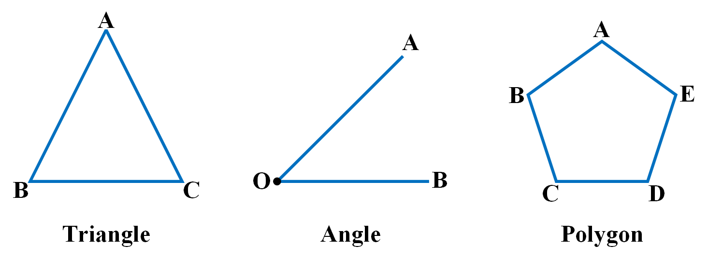

    Triangle(ABC)
    Angle(AOB)
    Polygon(ABCDE)

**4.旋转不变原则**  
图形旋转后还是原图形，各种性质不变，但点的位置变化了，因此一个图形可能有多个文字表示。在标注时，我们仅需标注一个表示即可，其他表示会由推理器自动构建。如下图三角形有三种表示方法，在标注时我们任选其一即可。    

    

    Triangle(ABC)
    Triangle(BCA)
    Triangle(CAB)

**4.具体情况具体分析**  
有些不封闭的图形，如平行、垂直等，用逆时针法则不符合人的思维习惯。这些特殊的图形将会在 doc/predicate.md 中写明它们的标注方法，请查阅。  

    

    Parallel(AB,CD)
    Perpendicular(AO,BO)

## 附录2 谓词标注对照手册
见 doc/predicate.md

## 附录3 定理标注对照手册
见 doc/theorem.md