## 定理标注对照手册
| 名称 | 类别 | 描述 |
| :--: | :--: | :--: |
| line_addition(AB,BC) | / | / |
| angle_addition(ABC,CBD) | / | / |
| flat_angle(ABC) | / | / |
| adjacent_complementary_angle(AOB,BOC) | / | / |
| midpoint_judgment(M,AB) | / | / |
| triangle_area_formula_common(AD,ABC) | / | / |
| triangle_area_formula_heron(ABC) | / | / |
| triangle_area_formula_sine(ABC) | / | / |
| triangle_perimeter_formula(ABC) | / | / |
| triangle_property_angle_sum(ABC) | / | / |
| triangle_property_equal_line_to_equal_angle(ABC) | / | / |
| triangle_property_equal_angle_to_equal_line(ABC) | / | / |
| sine_theorem(ABC) | / | / |
| cosine_theorem(ABC) | / | / |
| parallel_judgment_alternate_interior_angle(AB,CD) | / | / |
| parallel_judgment_Ipsilateral_internal_angle(AB,CD) | / | / |
| parallel_judgment_par_par(AB,CD,EF) | / | / |
| parallel_judgment_per_per(AB,CD) | / | / |
| parallel_property_collinear_extend(AB,CD,M) | / | / |
| parallel_property_alternate_interior_angle(AB,CD) | / | / |
| parallel_property_Ipsilateral_internal_angle(AB,CD) | / | / |
| parallel_property_corresponding_angle(AB,CD,E) | / | / |
| parallel_property_extend_perpendicular(AB,CD) | / | / |
| intersect_property_vertical_angle(O,AB,CD) | / | / |
| bisector_judgment_angle_equal(BD,ABC) | / | / |
| bisector_property_line_ratio(BD,ABC) | / | / |
| median_judgment(AD,ABC) | / | / |
| neutrality_judgment_parallel(DE,ABC) | / | / |
| neutrality_property_angle_equal(DE,ABC) | / | / |
| neutrality_property_line_ratio(DE,ABC) | / | / |
| neutrality_property_similar(DE,ABC) | / | / |
| altitude_judgment(AD,ABC) | / | / |
| perpendicular_bisector_judgment(AB,CO) | / | / |
| perpendicular_bisector_property_distance_equal(AB,CO) | / | / |
| perpendicular_bisector_property_bisector(AB,CO) | / | / |
| perpendicular_judgment_angle(AO,CO) | / | / |
| perpendicular_property_collinear_extend(AO,CO,B) | / | / |
| right_triangle_judgment_angle(ABC) | / | / |
| right_triangle_judgment_pythagorean_inverse(ABC) | / | / |
| right_triangle_property_pythagorean(ABC) | / | / |
| right_triangle_property_special_rt_30_60(ABC) | / | / |
| right_triangle_property_special_rt_45_45(ABC) | / | / |
| isosceles_triangle_judgment_angle_equal(ABC) | / | / |
| isosceles_triangle_judgment_equilateral(ABC) | / | / |
| isosceles_triangle_judgment_line_equal(ABC) | / | / |
| isosceles_triangle_property_angle_equal(ABC) | / | / |
| isosceles_triangle_property_line_coincidence(ABC) | / | / |
| equilateral_triangle_judgment_angle_equal(ABC) | / | / |
| equilateral_triangle_judgment_isos_and_angle(ABC) | / | / |
| equilateral_triangle_judgment_line_equal(ABC) | / | / |
| equilateral_triangle_property_angle(ABC) | / | / |
| equilateral_triangle_property_line_equal(ABC) | / | / |
| congruent_judgment_aas(ABC,DEF) | / | / |
| congruent_judgment_asa(ABC,DEF) | / | / |
| congruent_judgment_hl(ABC,DEF) | / | / |
| congruent_judgment_sas(ABC,DEF) | / | / |
| congruent_judgment_sss(ABC,DEF) | / | / |
| congruent_property_angle_equal(ABC,DEF) | / | / |
| congruent_property_area_equal(ABC,DEF) | / | / |
| congruent_property_line_equal(ABC,DEF) | / | / |
| congruent_property_perimeter_equal(ABC,DEF) | / | / |
| similar_judgment_aa(ABC,DEF) | / | / |
| similar_judgment_sas(ABC,DEF) | / | / |
| similar_judgment_sss(ABC,DEF) | / | / |
| similar_property_angle_equal(ABC,DEF) | / | / |
| similar_property_area_square_ratio(ABC,DEF) | / | / |
| similar_property_line_ratio(ABC,DEF) | / | / |
| similar_property_perimeter_ratio(ABC,DEF) | / | / |
| circumcenter_judgment(O,ABC,D,E) | / | / |
| circumcenter_property_intersect(O,ABC,D) | / | / |
| circumcenter_property_line_equal(O,ABC) | / | / |
| incenter_property_intersect(O,ABC) | / | / |
| incenter_property_judgment(O,ABC) | / | / |
| incenter_property_line_equal(O,ABC,D,E) | / | / |
| centroid_judgment(O,ABC,M,N) | / | / |
| centroid_property_intersect(O,ABC,M) | / | / |
| centroid_property_line_equal(O,ABC,M) | / | / |
| orthocenter_property_intersect(O,ABC,D) | / | / |
| orthocenter_property_judgment(O,ABC,D,E) | / | / |
| orthocenter_property_line_equal(O,ABC) | / | / |

### line_addition

    

    # branch 1
    Premise:Collinear(ABC)
    Conclusion:['Equal(LengthOfLine(AC),Add(LengthOfLine(AB),LengthOfLine(BC)))']
备注：  

### angle_addition

    

    # branch 1
    Premise:Angle(ABC)&Angle(CBD)
    Conclusion:['Equal(MeasureOfAngle(ABD),Add(MeasureOfAngle(ABC),MeasureOfAngle(CBD)))']
备注：  

### flat_angle

    

    # branch 1
    Premise:Collinear(ABC)
    Conclusion:['Equal(MeasureOfAngle(ABC),180)', 'Equal(MeasureOfAngle(CBA),180)']
备注：  

### adjacent_complementary_angle

    

    # branch 1
    Premise:Angle(AOB)&Angle(BOC)&Collinear(AOC)
    Conclusion:['Equal(Add(MeasureOfAngle(AOB),MeasureOfAngle(BOC)),180)']
备注：  

### midpoint_judgment

    

    # branch 1
    Premise:Collinear(AMB)&Equal(LengthOfLine(AM),LengthOfLine(MB))
    Conclusion:['Midpoint(M,AB)']
备注：  

### triangle_area_formula_common

    

    # branch 1
    Premise:IsAltitude(AD,ABC)
    Conclusion:['Equal(AreaOfTriangle(ABC),Mul(LengthOfLine(AD),LengthOfLine(BC),0.5))']
备注：  

### triangle_area_formula_heron

    

    # branch 1
    Premise:Triangle(ABC)
    Conclusion:['Equal(AreaOfTriangle(ABC),Pow(Mul(Mul(Add(LengthOfLine(AB),LengthOfLine(BC),LengthOfLine(AC)),0.5),Sub(Mul(Add(LengthOfLine(AB),LengthOfLine(BC),LengthOfLine(AC)),0.5),LengthOfLine(AB)),Sub(Mul(Add(LengthOfLine(AB),LengthOfLine(BC),LengthOfLine(AC)),0.5),LengthOfLine(BC)),Sub(Mul(Add(LengthOfLine(AB),LengthOfLine(BC),LengthOfLine(AC)),0.5),LengthOfLine(CA))),0.5))']
备注：  

### triangle_area_formula_sine

    

    # branch 1
    Premise:Triangle(ABC)
    Conclusion:['Equal(AreaOfTriangle(ABC),Mul(LengthOfLine(AB),LengthOfLine(AC),Sin(MeasureOfAngle(CAB)),1/2))']
备注：  

### triangle_perimeter_formula

    

    # branch 1
    Premise:Triangle(ABC)
    Conclusion:['Equal(PerimeterOfTriangle(ABC),Add(LengthOfLine(AB),LengthOfLine(BC),LengthOfLine(CA)))']
备注：  

### triangle_property_angle_sum

    

    # branch 1
    Premise:Triangle(ABC)
    Conclusion:['Equal(Add(MeasureOfAngle(ABC),MeasureOfAngle(BCA),MeasureOfAngle(CAB)),180)']
备注：  

### triangle_property_equal_line_to_equal_angle

    

    # branch 1
    Premise:Triangle(ABC)&Equal(LengthOfLine(AB),LengthOfLine(AC))
    Conclusion:['Equal(MeasureOfAngle(ABC),MeasureOfAngle(BCA))']
备注：  

### triangle_property_equal_angle_to_equal_line

    

    # branch 1
    Premise:Triangle(ABC)&Equal(MeasureOfAngle(ABC),MeasureOfAngle(BCA))
    Conclusion:['Equal(LengthOfLine(AB),LengthOfLine(AC))']
备注：  

### sine_theorem

    

    # branch 1
    Premise:Triangle(ABC)
    Conclusion:['Equal(Mul(LengthOfLine(AB),Sin(MeasureOfAngle(ABC))),Mul(LengthOfLine(AC),Sin(MeasureOfAngle(BCA))))']
备注：  

### cosine_theorem

    

    # branch 1
    Premise:Triangle(ABC)
    Conclusion:['Equal(Add(Pow(LengthOfLine(BC),2),Mul(2,LengthOfLine(AB),LengthOfLine(AC),Cos(MeasureOfAngle(CAB)))),Add(Pow(LengthOfLine(AB),2),Pow(LengthOfLine(AC),2)))']
备注：  

### parallel_judgment_alternate_interior_angle

    

    # branch 1
    Premise:Angle(BAD)&Angle(CDA)&Equal(MeasureOfAngle(BAD),MeasureOfAngle(CDA))
    Conclusion:['Parallel(AB,CD)']
备注：  

### parallel_judgment_Ipsilateral_internal_angle

    

    # branch 1
    Premise:Angle(BAC)&Angle(ACD)&Equal(Add(MeasureOfAngle(BAC),MeasureOfAngle(ACD)),180)
    Conclusion:['Parallel(AB,CD)']
备注：  

### parallel_judgment_par_par

    

    # branch 1
    Premise:Parallel(AB,CD)&Parallel(CD,EF)
    Conclusion:['Parallel(AB,EF)']
备注：  

### parallel_judgment_per_per

    

    # branch 1
    Premise:Perpendicular(BA,CA)&Perpendicular(AC,DC)
    Conclusion:['Parallel(AB,CD)']
    # branch 2
    Premise:Perpendicular(CD,AD)&Perpendicular(BA,DA)
    Conclusion:['Parallel(AB,CD)']
备注：  

### parallel_property_collinear_extend

    

    # branch 1
    Premise:Collinear(AMB)&Parallel(AB,CD)
    Conclusion:['Parallel(AM,CD)', 'Parallel(MB,CD)']
    # branch 2
    Premise:Collinear(MAB)&Parallel(AB,CD)
    Conclusion:['Parallel(MA,CD)', 'Parallel(MB,CD)']
    # branch 3
    Premise:Collinear(ABM)&Parallel(AB,CD)
    Conclusion:['Parallel(AM,CD)', 'Parallel(BM,CD)']
备注：  

### parallel_property_alternate_interior_angle

    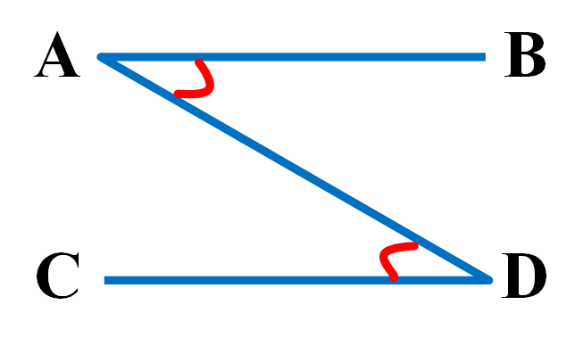

    # branch 1
    Premise:Parallel(AB,CD)&Line(AD)
    Conclusion:['Equal(MeasureOfAngle(BAD),MeasureOfAngle(CDA))']
备注：  

### parallel_property_Ipsilateral_internal_angle

    

    # branch 1
    Premise:Parallel(AB,CD)&Line(AC)
    Conclusion:['Equal(Add(MeasureOfAngle(BAC),MeasureOfAngle(ACD)),180)']
备注：  

### parallel_property_corresponding_angle

    

    # branch 1
    Premise:Parallel(AB,CD)&Collinear(EAC)
    Conclusion:['Equal(MeasureOfAngle(EAB),MeasureOfAngle(ACD))']
    # branch 2
    Premise:Parallel(AB,CD)&Collinear(ACE)
    Conclusion:['Equal(MeasureOfAngle(BAC),MeasureOfAngle(DCE))']
备注：  

### parallel_property_extend_perpendicular

    

    # branch 1
    Premise:Parallel(AB,CD)&Perpendicular(AC,DC)
    Conclusion:['Perpendicular(BA,CA)']
    # branch 2
    Premise:Parallel(AB,CD)&Perpendicular(BA,CA)
    Conclusion:['Perpendicular(AC,DC)']
备注：  

### intersect_property_vertical_angle

    

    # branch 1
    Premise:Intersect(O,AB,CD)
    Conclusion:['Equal(MeasureOfAngle(AOC),MeasureOfAngle(BOD))']
备注：  

### bisector_judgment_angle_equal

    

    # branch 1
    Premise:Angle(ABD)&Angle(DBC)&Equal(MeasureOfAngle(ABD),MeasureOfAngle(DBC))
    Conclusion:['Bisector(BD,ABC)']
备注：  

### bisector_property_line_ratio

    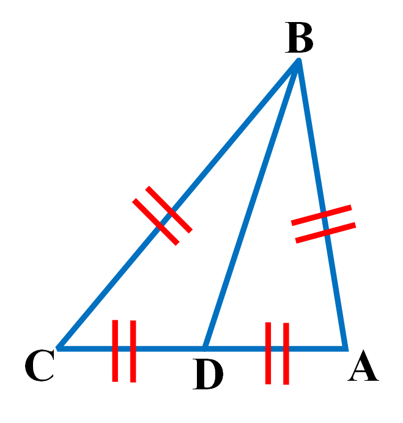

    # branch 1
    Premise:Bisector(BD,ABC)&Collinear(CDA)
    Conclusion:['Equal(Mul(LengthOfLine(CD),LengthOfLine(BA)),Mul(LengthOfLine(DA),LengthOfLine(BC)))']
备注：  

### median_judgment

    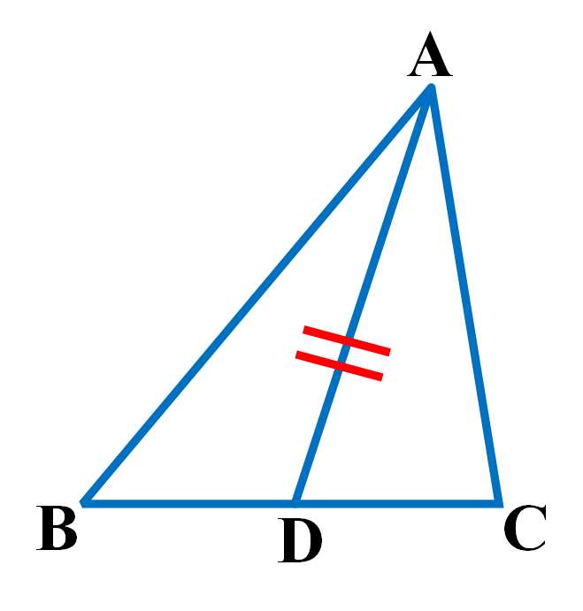

    # branch 1
    Premise:Triangle(ABC)&Midpoint(D,BC)&Line(AD)
    Conclusion:['Median(AD,ABC)']
备注：  

### neutrality_judgment_parallel

    

    # branch 1
    Premise:Triangle(ABC)&Collinear(ADB)&Collinear(AEC)&Parallel(DE,BC)
    Conclusion:['Neutrality(DE,ABC)']
备注：  

### neutrality_property_angle_equal

    

    # branch 1
    Premise:Neutrality(DE,ABC)
    Conclusion:['Equal(MeasureOfAngle(ADE),MeasureOfAngle(ABC))', 'Equal(MeasureOfAngle(DEA),MeasureOfAngle(BCA))']
备注：  

### neutrality_property_line_ratio

    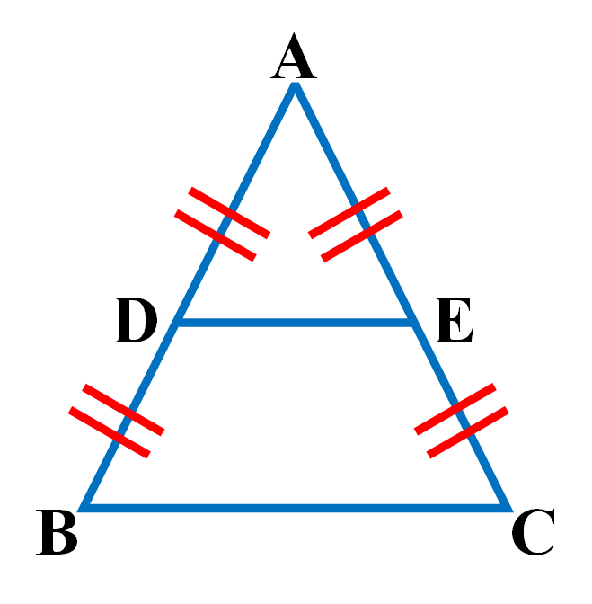

    # branch 1
    Premise:Neutrality(DE,ABC)
    Conclusion:['Equal(Mul(LengthOfLine(AD),LengthOfLine(EC)),Mul(LengthOfLine(DB),LengthOfLine(AE)))']
备注：  

### neutrality_property_similar

    

    # branch 1
    Premise:Neutrality(DE,ABC)
    Conclusion:['Similar(ABC,ADE)']
备注：  

### altitude_judgment

    

    # branch 1
    Premise:Triangle(ABC)&Collinear(BDC)&Line(AD)&(Equal(MeasureOfAngle(BDA),90)|Equal(MeasureOfAngle(ADC),90))
    Conclusion:['IsAltitude(AD,ABC)']
备注：  

### perpendicular_bisector_judgment

    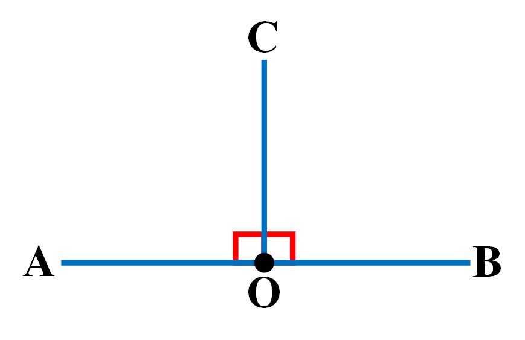

    # branch 1
    Premise:Collinear(AOB)&(Perpendicular(AO,CO)|Equal(MeasureOfAngle(AOC),90)|Perpendicular(CO,BO)|Equal(MeasureOfAngle(COB),90))&(Midpoint(O,AB)|Equal(LengthOfLine(AO),LengthOfLine(OB)))
    Conclusion:['PerpendicularBisector(AB,CO)']
备注：  

### perpendicular_bisector_property_distance_equal

    

    # branch 1
    Premise:PerpendicularBisector(AB,CO)
    Conclusion:['Equal(LengthOfLine(CA),LengthOfLine(CB))']
备注：  

### perpendicular_bisector_property_bisector

    

    # branch 1
    Premise:PerpendicularBisector(AB,CO)&Angle(BCO)&Angle(OCA)
    Conclusion:['Bisector(CO,BCA)']
备注：  

### perpendicular_judgment_angle

    

    # branch 1
    Premise:Angle(AOC)&Equal(MeasureOfAngle(AOC),90)
    Conclusion:['Perpendicular(AO,CO)']
备注：  

### perpendicular_property_collinear_extend

    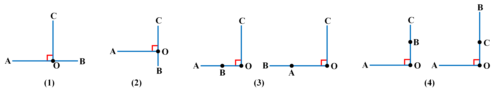

    # branch 1
    Premise:Perpendicular(AO,CO)&Collinear(AOB)
    Conclusion:['Perpendicular(CO,BO)']
    # branch 2
    Premise:Perpendicular(AO,CO)&Collinear(BOC)
    Conclusion:['Perpendicular(BO,AO)']
    # branch 3
    Premise:Perpendicular(AO,CO)&(Collinear(ABO)|Collinear(BAO))
    Conclusion:['Perpendicular(BO,CO)']
    # branch 4
    Premise:Perpendicular(AO,CO)&(Collinear(OBC)|Collinear(OCB))
    Conclusion:['Perpendicular(AO,BO)']
备注：  

### right_triangle_judgment_angle

    

    # branch 1
    Premise:Triangle(ABC)&(Perpendicular(AB,CB)|Equal(MeasureOfAngle(ABC),90))
    Conclusion:['RightTriangle(ABC)']
备注：  

### right_triangle_judgment_pythagorean_inverse

    

    # branch 1
    Premise:Triangle(ABC)&Equal(Add(Pow(LengthOfLine(AB),2),Pow(LengthOfLine(BC),2)),Pow(LengthOfLine(AC),2))
    Conclusion:['RightTriangle(ABC)']
备注：  

### right_triangle_property_pythagorean

    

    # branch 1
    Premise:RightTriangle(ABC)
    Conclusion:['Equal(Add(Pow(LengthOfLine(AB),2),Pow(LengthOfLine(BC),2)),Pow(LengthOfLine(AC),2))']
备注：  

### right_triangle_property_special_rt_30_60

    

    # branch 1
    Premise:RightTriangle(ABC)&(Equal(MeasureOfAngle(CAB),30)|Equal(MeasureOfAngle(BCA),60))
    Conclusion:['Equal(LengthOfLine(AB),Mul(LengthOfLine(BC),1.7321))', 'Equal(LengthOfLine(AC),Mul(LengthOfLine(BC),2))']
    # branch 2
    Premise:RightTriangle(ABC)&(Equal(MeasureOfAngle(CAB),60)|Equal(MeasureOfAngle(BCA),30))
    Conclusion:['Equal(LengthOfLine(BC),Mul(LengthOfLine(AB),1.7321))', 'Equal(LengthOfLine(AC),Mul(LengthOfLine(AB),2))']
备注：  

### right_triangle_property_special_rt_45_45

    

    # branch 1
    Premise:RightTriangle(ABC)&(Equal(MeasureOfAngle(CAB),45)|Equal(MeasureOfAngle(BCA),45))
    Conclusion:['Equal(LengthOfLine(AB),LengthOfLine(BC))', 'Equal(LengthOfLine(AC),Mul(LengthOfLine(AB),1.4142))']
备注：  

### isosceles_triangle_judgment_angle_equal

    

    # branch 1
    Premise:Triangle(ABC)&Equal(MeasureOfAngle(ABC),MeasureOfAngle(BCA))
    Conclusion:['IsoscelesTriangle(ABC)']
备注：  

### isosceles_triangle_judgment_equilateral

    

    # branch 1
    Premise:EquilateralTriangle(ABC)
    Conclusion:['IsoscelesTriangle(ABC)']
备注：  

### isosceles_triangle_judgment_line_equal

    

    # branch 1
    Premise:Triangle(ABC)&Equal(LengthOfLine(AB),LengthOfLine(AC))
    Conclusion:['IsoscelesTriangle(ABC)']
备注：  

### isosceles_triangle_property_angle_equal

    

    # branch 1
    Premise:IsoscelesTriangle(ABC)
    Conclusion:['Equal(MeasureOfAngle(ABC),MeasureOfAngle(BCA))']
备注：  

### isosceles_triangle_property_line_coincidence

    

    # branch 1
    Premise:IsoscelesTriangle(ABC)&IsAltitude(AM,ABC)
    Conclusion:['Median(AM,ABC)', 'Bisector(AM,CAB)']
    # branch 2
    Premise:IsoscelesTriangle(ABC)&Median(AM,ABC)
    Conclusion:['IsAltitude(AM,ABC)', 'Bisector(AM,CAB)']
    # branch 3
    Premise:IsoscelesTriangle(ABC)&Collinear(BMC)&Bisector(AM,CAB)
    Conclusion:['IsAltitude(AM,ABC)', 'Median(AM,ABC)']
备注：  

### equilateral_triangle_judgment_angle_equal

    

    # branch 1
    Premise:Triangle(ABC)&Equal(MeasureOfAngle(ABC),MeasureOfAngle(BCA))&Equal(MeasureOfAngle(BCA),MeasureOfAngle(CAB))
    Conclusion:['EquilateralTriangle(ABC)']
备注：  

### equilateral_triangle_judgment_isos_and_angle

    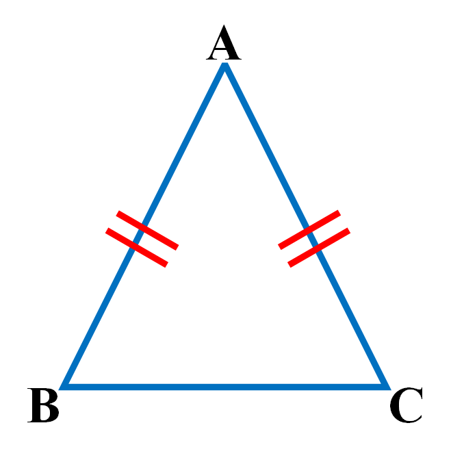

    # branch 1
    Premise:IsoscelesTriangle(ABC)&(Equal(MeasureOfAngle(ABC),60)|Equal(MeasureOfAngle(BCA),60)|Equal(MeasureOfAngle(CAB),60))
    Conclusion:['EquilateralTriangle(ABC)']
备注：  

### equilateral_triangle_judgment_line_equal

    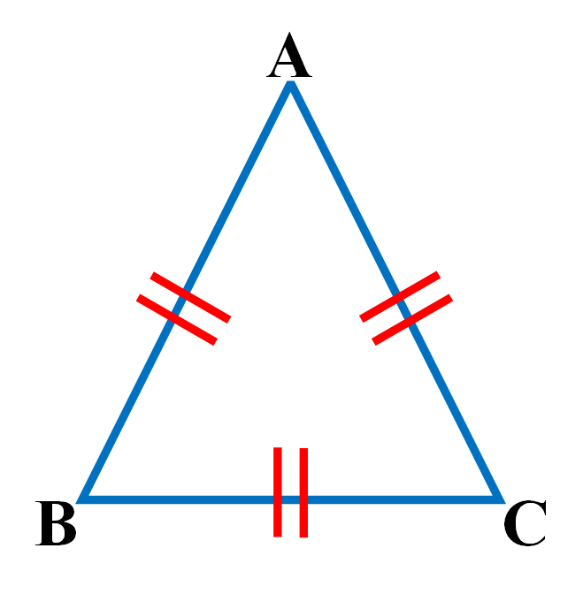

    # branch 1
    Premise:Triangle(ABC)&Equal(LengthOfLine(AB),LengthOfLine(BC))&Equal(LengthOfLine(BC),LengthOfLine(AC))
    Conclusion:['EquilateralTriangle(ABC)']
备注：  

### equilateral_triangle_property_angle

    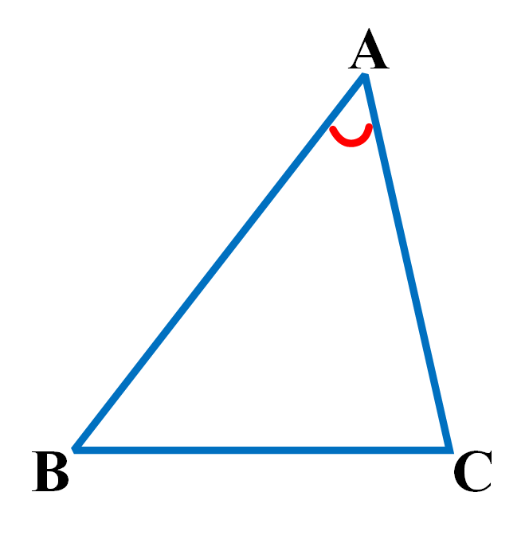

    # branch 1
    Premise:EquilateralTriangle(ABC)
    Conclusion:['Equal(MeasureOfAngle(ABC),60)']
备注：  

### equilateral_triangle_property_line_equal

    

    # branch 1
    Premise:EquilateralTriangle(ABC)
    Conclusion:['Equal(LengthOfLine(AB),LengthOfLine(BC))']
备注：  

### congruent_judgment_aas

    

    # branch 1
    Premise:Triangle(ABC)&Triangle(DEF)&Equal(MeasureOfAngle(ABC),MeasureOfAngle(DEF))&Equal(MeasureOfAngle(BCA),MeasureOfAngle(EFD))&Equal(LengthOfLine(CA),LengthOfLine(FD))
    Conclusion:['Congruent(ABC,DEF)']
    # branch 2
    Premise:Triangle(ABC)&Triangle(DEF)&Equal(MeasureOfAngle(ABC),MeasureOfAngle(EFD))&Equal(MeasureOfAngle(BCA),MeasureOfAngle(DEF))&Equal(LengthOfLine(CA),LengthOfLine(DE))
    Conclusion:['MirrorCongruent(ABC,DEF)']
备注：  

### congruent_judgment_asa

    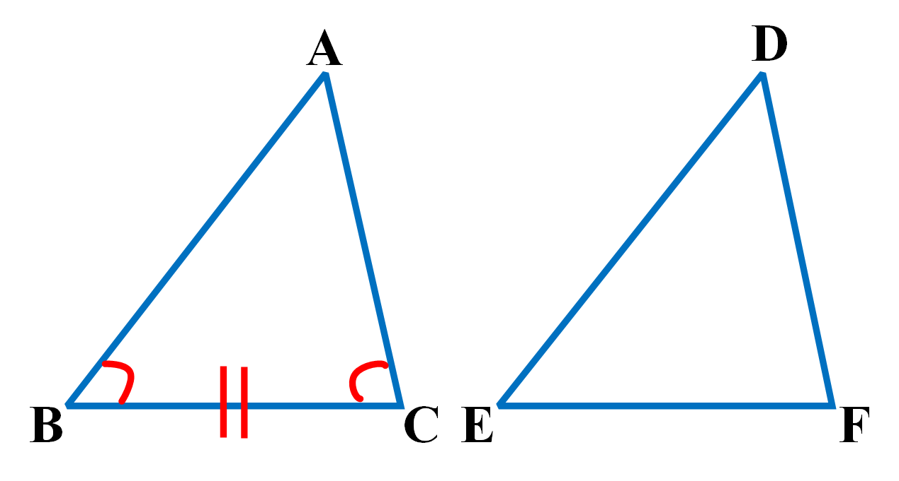

    # branch 1
    Premise:Triangle(ABC)&Triangle(DEF)&Equal(MeasureOfAngle(ABC),MeasureOfAngle(DEF))&Equal(LengthOfLine(BC),LengthOfLine(EF))&Equal(MeasureOfAngle(BCA),MeasureOfAngle(EFD))
    Conclusion:['Congruent(ABC,DEF)']
    # branch 2
    Premise:Triangle(ABC)&Triangle(DEF)&Equal(MeasureOfAngle(ABC),MeasureOfAngle(EFD))&Equal(LengthOfLine(BC),LengthOfLine(EF))&Equal(MeasureOfAngle(BCA),MeasureOfAngle(DEF))
    Conclusion:['MirrorCongruent(ABC,DEF)']
备注：  

### congruent_judgment_hl

    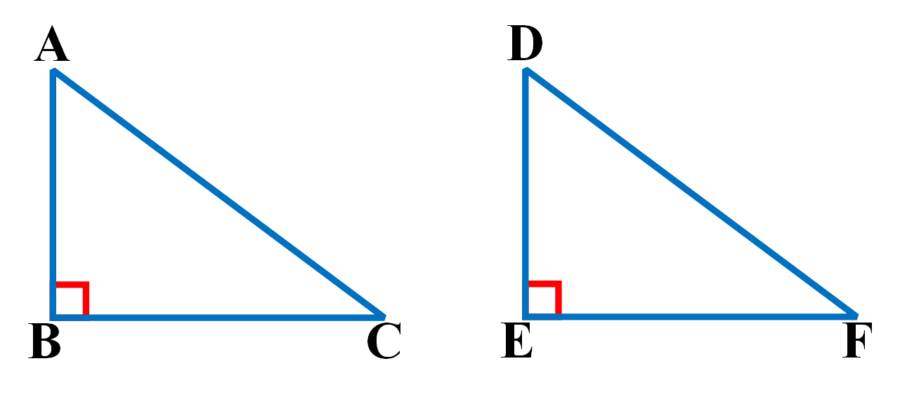

    # branch 1
    Premise:RightTriangle(ABC)&RightTriangle(DEF)&Equal(LengthOfLine(AC),LengthOfLine(DF))&(Equal(LengthOfLine(AB),LengthOfLine(DE))|Equal(LengthOfLine(BC),LengthOfLine(EF)))
    Conclusion:['Congruent(ABC,DEF)']
    # branch 2
    Premise:RightTriangle(BCA)&RightTriangle(DEF)&Equal(LengthOfLine(AB),LengthOfLine(DF))&(Equal(LengthOfLine(AC),LengthOfLine(DE))|Equal(LengthOfLine(BC),LengthOfLine(EF)))
    Conclusion:['MirrorCongruent(ABC,DEF)']
备注：  

### congruent_judgment_sas

    

    # branch 1
    Premise:Triangle(ABC)&Triangle(DEF)&Equal(LengthOfLine(AB),LengthOfLine(DE))&Equal(MeasureOfAngle(ABC),MeasureOfAngle(DEF))&Equal(LengthOfLine(BC),LengthOfLine(EF))
    Conclusion:['Congruent(ABC,DEF)']
    # branch 2
    Premise:Triangle(ABC)&Triangle(DEF)&Equal(LengthOfLine(AB),LengthOfLine(FD))&Equal(MeasureOfAngle(ABC),MeasureOfAngle(EFD))&Equal(LengthOfLine(BC),LengthOfLine(EF))
    Conclusion:['MirrorCongruent(ABC,DEF)']
备注：  

### congruent_judgment_sss

    

    # branch 1
    Premise:Triangle(ABC)&Triangle(DEF)&Equal(LengthOfLine(AB),LengthOfLine(DE))&Equal(LengthOfLine(BC),LengthOfLine(EF))&Equal(LengthOfLine(CA),LengthOfLine(FD))
    Conclusion:['Congruent(ABC,DEF)']
    # branch 2
    Premise:Triangle(ABC)&Triangle(DEF)&Equal(LengthOfLine(AB),LengthOfLine(FD))&Equal(LengthOfLine(BC),LengthOfLine(EF))&Equal(LengthOfLine(CA),LengthOfLine(DE))
    Conclusion:['MirrorCongruent(ABC,DEF)']
备注：  

### congruent_property_angle_equal

    

    # branch 1
    Premise:Congruent(ABC,DEF)
    Conclusion:['Equal(MeasureOfAngle(ABC),MeasureOfAngle(DEF))']
    # branch 2
    Premise:MirrorCongruent(ABC,DEF)
    Conclusion:['Equal(MeasureOfAngle(ABC),MeasureOfAngle(EFD))']
备注：  

### congruent_property_area_equal

    

    # branch 1
    Premise:Congruent(ABC,DEF)
    Conclusion:['Equal(AreaOfTriangle(ABC),AreaOfTriangle(DEF))']
    # branch 2
    Premise:MirrorCongruent(ABC,DEF)
    Conclusion:['Equal(AreaOfTriangle(ABC),AreaOfTriangle(DEF))']
备注：  

### congruent_property_line_equal

    

    # branch 1
    Premise:Congruent(ABC,DEF)
    Conclusion:['Equal(LengthOfLine(AB),LengthOfLine(DE))']
    # branch 2
    Premise:MirrorCongruent(ABC,DEF)
    Conclusion:['Equal(LengthOfLine(AB),LengthOfLine(DF))']
备注：  

### congruent_property_perimeter_equal

    

    # branch 1
    Premise:Congruent(ABC,DEF)
    Conclusion:['Equal(PerimeterOfTriangle(ABC),PerimeterOfTriangle(DEF))']
    # branch 2
    Premise:MirrorCongruent(ABC,DEF)
    Conclusion:['Equal(PerimeterOfTriangle(ABC),PerimeterOfTriangle(DEF))']
备注：  

### similar_judgment_aa

    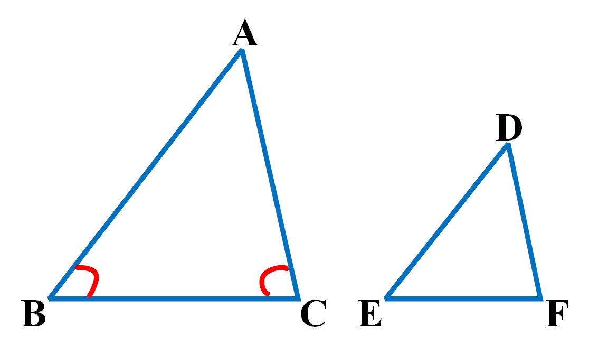

    # branch 1
    Premise:Triangle(ABC)&Triangle(DEF)&Equal(MeasureOfAngle(CAB),MeasureOfAngle(FDE))&Equal(MeasureOfAngle(ABC),MeasureOfAngle(DEF))
    Conclusion:['Similar(ABC,DEF)']
    # branch 2
    Premise:Triangle(ABC)&Triangle(DEF)&Equal(MeasureOfAngle(CAB),MeasureOfAngle(FDE))&Equal(MeasureOfAngle(ABC),MeasureOfAngle(EFD))
    Conclusion:['MirrorSimilar(ABC,DEF)']
备注：  

### similar_judgment_sas

    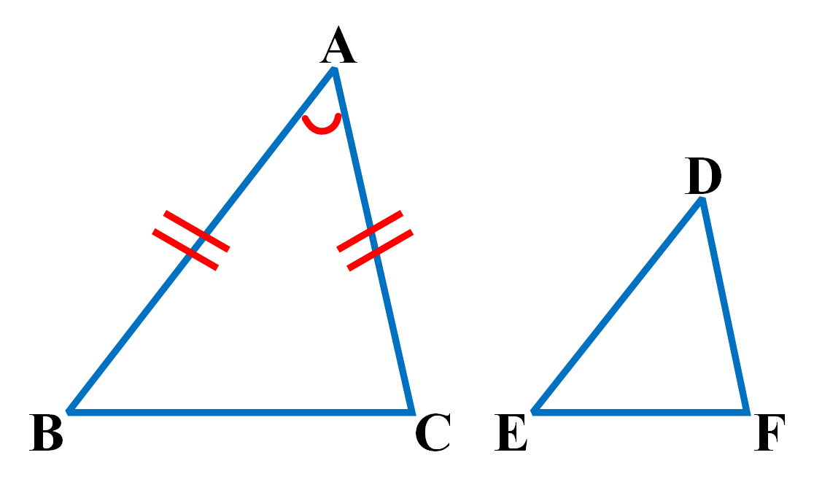

    # branch 1
    Premise:Triangle(ABC)&Triangle(DEF)&Equal(Mul(LengthOfLine(AB),LengthOfLine(EF)),Mul(LengthOfLine(DE),LengthOfLine(BC)))&Equal(MeasureOfAngle(ABC),MeasureOfAngle(DEF))
    Conclusion:['Similar(ABC,DEF)']
    # branch 2
    Premise:Triangle(ABC)&Triangle(DEF)&Equal(Mul(LengthOfLine(AB),LengthOfLine(EF)),Mul(LengthOfLine(FD),LengthOfLine(BC)))&Equal(MeasureOfAngle(ABC),MeasureOfAngle(EFD))
    Conclusion:['MirrorSimilar(ABC,DEF)']
备注：  

### similar_judgment_sss

    

    # branch 1
    Premise:Triangle(ABC)&Triangle(DEF)&Equal(Mul(LengthOfLine(AB),LengthOfLine(EF)),Mul(LengthOfLine(DE),LengthOfLine(BC)))&Equal(Mul(LengthOfLine(AB),LengthOfLine(DF)),Mul(LengthOfLine(DE),LengthOfLine(CA)))
    Conclusion:['Similar(ABC,DEF)']
    # branch 2
    Premise:Triangle(ABC)&Triangle(DEF)&Equal(Mul(LengthOfLine(AB),LengthOfLine(EF)),Mul(LengthOfLine(FD),LengthOfLine(BC)))&Equal(Mul(LengthOfLine(AB),LengthOfLine(DE)),Mul(LengthOfLine(FD),LengthOfLine(CA)))
    Conclusion:['MirrorSimilar(ABC,DEF)']
备注：  

### similar_property_angle_equal

    

    # branch 1
    Premise:Similar(ABC,DEF)
    Conclusion:['Equal(MeasureOfAngle(ABC),MeasureOfAngle(DEF))']
    # branch 2
    Premise:MirrorSimilar(ABC,DEF)
    Conclusion:['Equal(MeasureOfAngle(ABC),MeasureOfAngle(EFD))']
备注：  

### similar_property_area_square_ratio

    

    # branch 1
    Premise:Similar(ABC,DEF)
    Conclusion:['Equal(Mul(LengthOfLine(AB),LengthOfLine(AB),AreaOfTriangle(DEF)),Mul(LengthOfLine(DE),LengthOfLine(DE),AreaOfTriangle(ABC)))']
    # branch 2
    Premise:MirrorSimilar(ABC,DEF)
    Conclusion:['Equal(Mul(LengthOfLine(AB),LengthOfLine(AB),AreaOfTriangle(DEF)),Mul(LengthOfLine(FD),LengthOfLine(FD),AreaOfTriangle(ABC)))']
备注：  

### similar_property_line_ratio

    

    # branch 1
    Premise:Similar(ABC,DEF)
    Conclusion:['Equal(Mul(LengthOfLine(AB),LengthOfLine(EF)),Mul(LengthOfLine(DE),LengthOfLine(BC)))']
    # branch 2
    Premise:MirrorSimilar(ABC,DEF)
    Conclusion:['Equal(Mul(LengthOfLine(AB),LengthOfLine(EF)),Mul(LengthOfLine(FD),LengthOfLine(BC)))']
备注：  

### similar_property_perimeter_ratio

    

    # branch 1
    Premise:Similar(ABC,DEF)
    Conclusion:['Equal(Mul(LengthOfLine(AB),PerimeterOfTriangle(DEF)),Mul(LengthOfLine(DE),PerimeterOfTriangle(ABC)))']
    # branch 2
    Premise:MirrorSimilar(ABC,DEF)
    Conclusion:['Equal(Mul(LengthOfLine(AB),PerimeterOfTriangle(DEF)),Mul(LengthOfLine(FD),PerimeterOfTriangle(ABC)))']
备注：  

### circumcenter_judgment

    

    # branch 1
    Premise:Triangle(ABC)&Collinear(BDC)&Collinear(CEA)&PerpendicularBisector(BC,OD)&PerpendicularBisector(CA,OE)
    Conclusion:['Circumcenter(O,ABC)']
备注：  

### circumcenter_property_intersect

    

    # branch 1
    Premise:Circumcenter(O,ABC)&Collinear(BDC)&(Perpendicular(BD,OD)|Perpendicular(OD,CD))
    Conclusion:['PerpendicularBisector(BC,OD)']
    # branch 2
    Premise:Circumcenter(O,ABC)&Midpoint(M,BC)
    Conclusion:['PerpendicularBisector(BC,OM)']
备注：  

### circumcenter_property_line_equal

    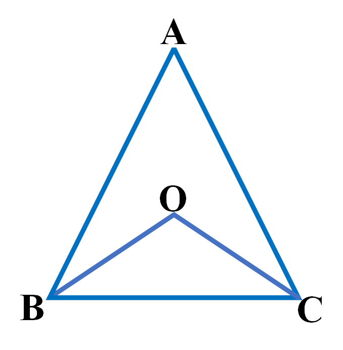

    # branch 1
    Premise:Circumcenter(O,ABC)
    Conclusion:['Equal(LengthOfLine(OA),LengthOfLine(OB))']
备注：  

### incenter_property_intersect

    

    # branch 1
    Premise:Incenter(O,ABC)
    Conclusion:['Bisector(AO,CAB)']
备注：  

### incenter_property_judgment

    

    # branch 1
    Premise:Triangle(ABC)&Bisector(AO,CAB)&Bisector(CO,BCA)
    Conclusion:['Incenter(O,ABC)']
备注：  

### incenter_property_line_equal

    

    # branch 1
    Premise:Incenter(O,ABC)&Collinear(ADB)&Collinear(BEC)&(Perpendicular(AD,OD)|Perpendicular(OD,BD))&(Perpendicular(BE,OE)|Perpendicular(OE,CE))
    Conclusion:['Equal(LengthOfLine(OD),LengthOfLine(OE))']
备注：  

### centroid_judgment

    

    # branch 1
    Premise:Triangle(ABC)&Median(AM,ABC)&Median(BN,BCA)&Collinear(AOM)&Collinear(BON)
    Conclusion:['Centroid(O,ABC)']
备注：  

### centroid_property_intersect

    

    # branch 1
    Premise:Centroid(O,ABC)&Collinear(AOM)&Collinear(BMC)
    Conclusion:['Median(AM,ABC)']
备注：  

### centroid_property_line_equal

    

    # branch 1
    Premise:Centroid(O,ABC)&Collinear(AOM)&Collinear(BMC)
    Conclusion:['Equal(LengthOfLine(OA),Mul(LengthOfLine(OM),2))']
备注：  

### orthocenter_property_intersect

    

    # branch 1
    Premise:Orthocenter(O,ABC)&Collinear(AOD)&Collinear(BDC)
    Conclusion:['IsAltitude(AD,ABC)']
备注：  

### orthocenter_property_judgment

    

    # branch 1
    Premise:Triangle(ABC)&IsAltitude(AD,ABC)&IsAltitude(BE,BCA)&Intersect(O,DA,BE)
    Conclusion:['Orthocenter(O,ABC)']
备注：  

### orthocenter_property_line_equal

    

    # branch 1
    Premise:Orthocenter(O,ABC)&Angle(COB)
    Conclusion:['Equal(MeasureOfAngle(COB),Add(MeasureOfAngle(ABC),MeasureOfAngle(BCA)))']
备注：  

